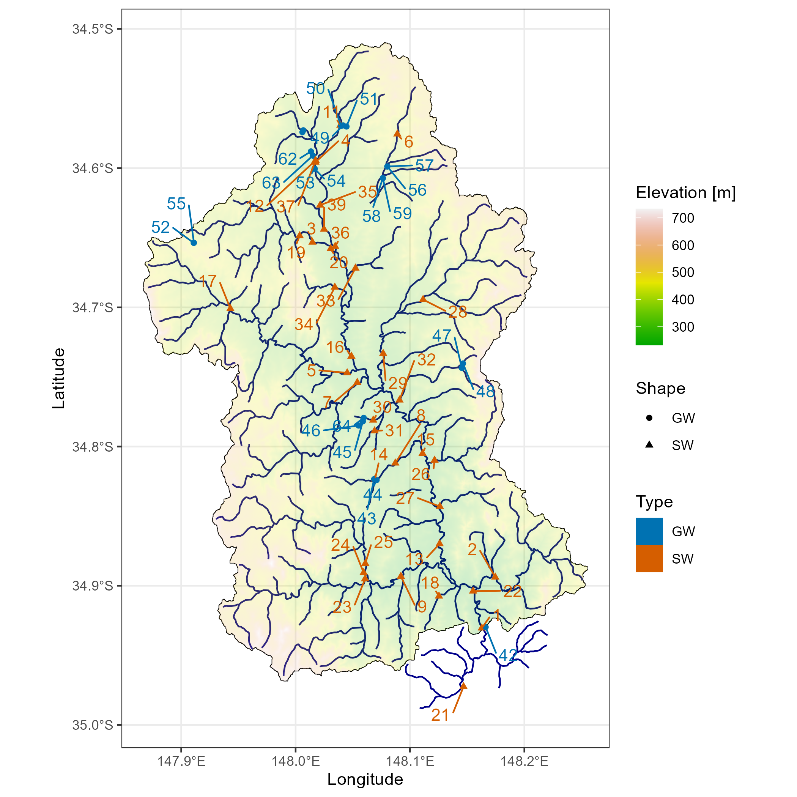
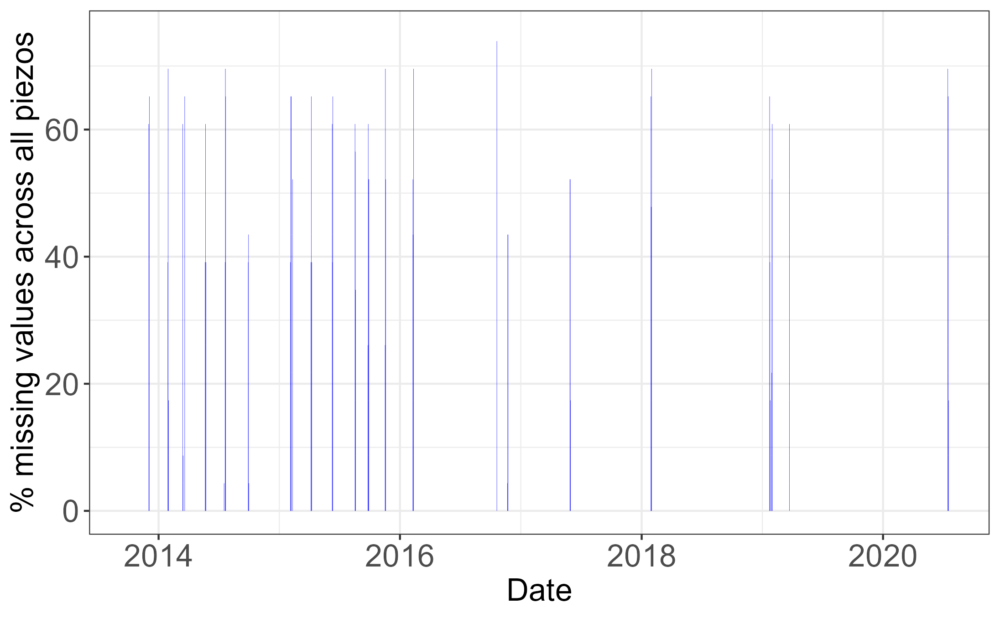
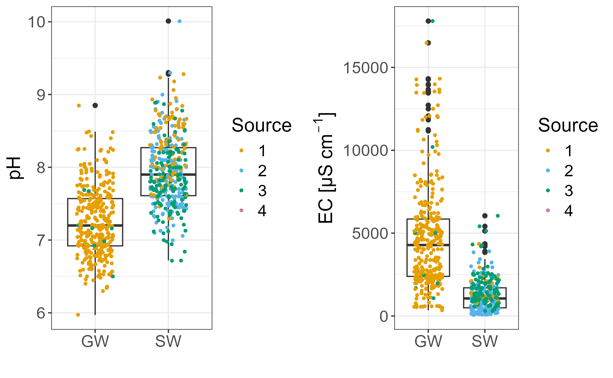
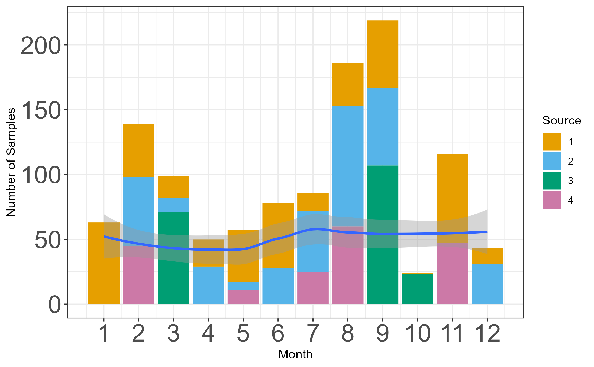
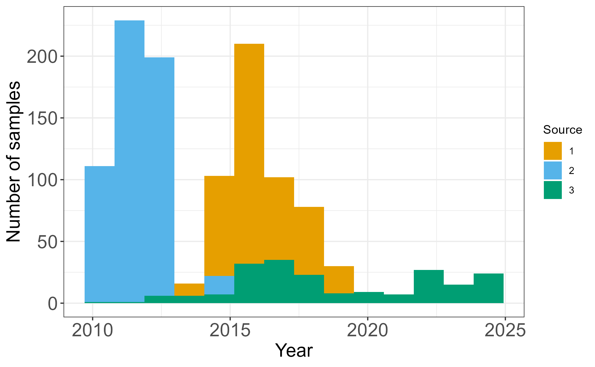
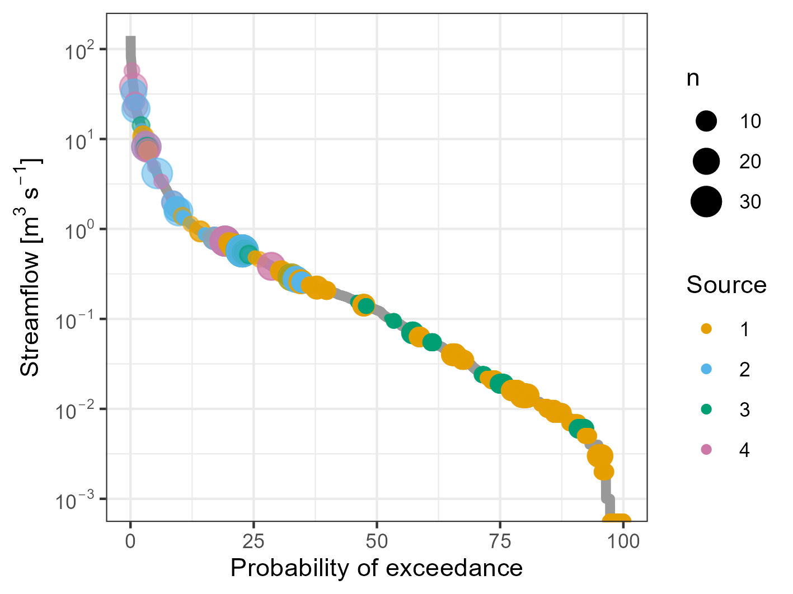
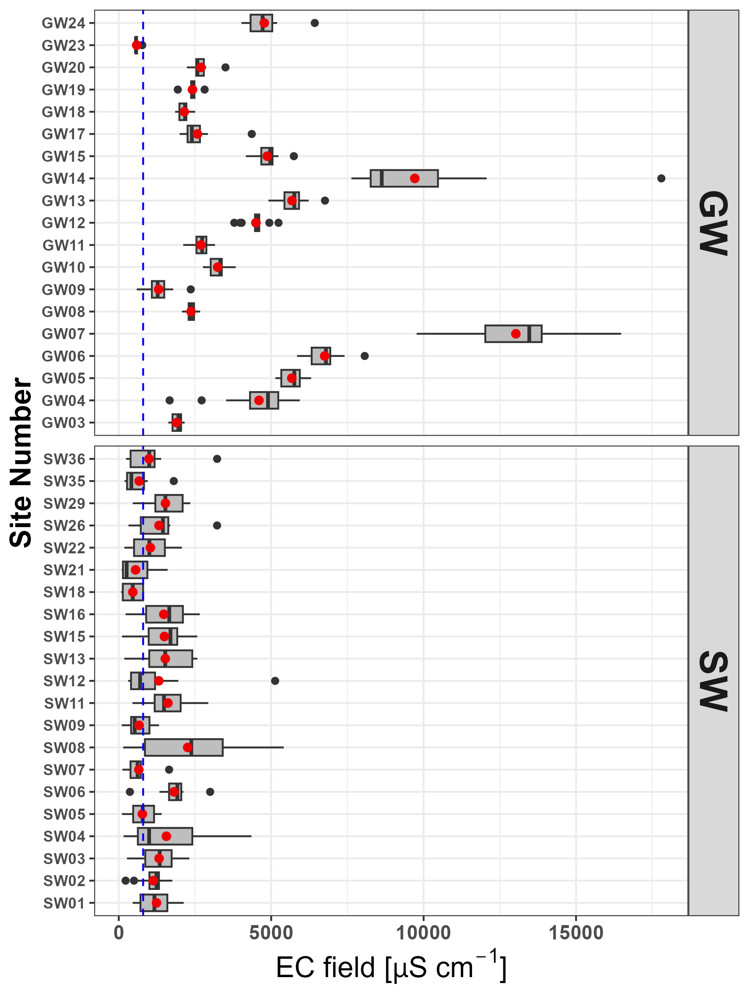
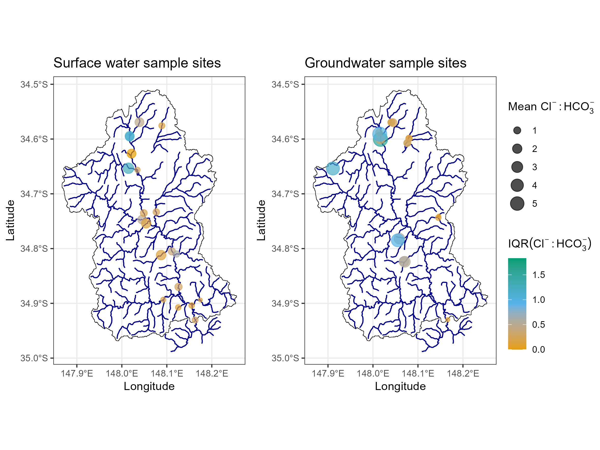

```{r packages, echo=F, warning=F, include=F, message=F}
options(tinytex.verbose = TRUE)


require(knitr)
require(bookdown)
require(pander)
require(tidyverse)
require(lubridate)
require(ggpubr) # saving ggplot figures
library(kableExtra) ##table formatting package
require(multirow)
require(caption)
#require(mgcv) # probably no longer needed
library(sf)
library(rgdal)
#library(graphics) #needed?
library(raster)
library(ggspatial)
require(factoextra)
theme_set(theme_bw()) # ggplot theme
```

\introduction

<!--setting the scene-->
Dryland and irrigation salinity has long been a major natural resource management concern in Australia [@Jolly2001; @White2009; @Scanlon2007; @Walker2002; @Finlayson2010]. The success of management of salinity, while extensively documented, has remained patchy [@Leblanc2012]. As a result, the volume of research and number of publications in this area has decreased significantly in recent years (Figure \ref{fig:SalinityPapers}). This is partly due to the effect of the millenium drought on groundwater levels and consequently salinity [@Mcfarlane2016], but this is also because of the increased understanding that salinity processes can vary substantially  across the landscape [@Conyers2008] and that the processes of salt delivery to the stream also varies in the landscape [@Summerell2006; @Hughes2007] and is dependent on landscape characteristics [@vanDijk2008; @Dalhaus2010].

```{r, echo = F, eval = F}
dry<-read_csv("../Muttama Dataset analysis/Data/dryland salinity papers.csv")%>%
  dplyr::rename(Year='Publication year')%>%
  dplyr::rename(Papers='Number of Papers')

dry%>%
  dplyr::select(Year,Papers)%>%
    ggplot(aes(Year,Papers)) + geom_col(fill='slateblue3') +theme_classic2() +xlab('Year of Publication') + ylab('Number of Papers')
ggsave('Figures/Dryland Salinity Papers.png',dpi=300)

```


```{r SalinityPapers, echo=F, fig.cap = "Number of papers on the Web of Science related to the search terms (Dryland Salinity) AND Australia 1980 - 2022", out.width="90%"}
knitr::include_graphics("Figures/Dryland Salinity Papers.png")
#Dryland Salinity Papers.rmd
```


The poor spatial and timescale distribution of water quality datasets has long been an obstacle to measuring trends in salinity. Studies such as Jolly et. al. [-@Jolly2001] and White et. al [-@White2009] used large historical datasets to detect broadscale trends over large periods throughout the Murray Darling Basin (MDB). This work identified that southern and eastern dryland region in the Murray Darling Basin have rising salinity trends that were worse in areas of low rainfall [@White2009; @Jolly2001]. However, the ion composition varied greatly throughout the MDB [@White2009]. More specifically, Conyers et al. [-@Conyers2008] tried to isolate which areas of land in the Murrumbidgee catchment acted as sources of salinity, as well as whether this was predominantly marine cyclic salts (NaCl) as previously assumed, or whether salts from mineral weathering were also involved (e.g. Ca, Mg, HCO~3~). While both can be measured using conventional methods such as EC, a rise in marine cyclic salts can be a major source of osmotic stress, whereas mineral weathering salts are far less harmful and more likely to precipitate at reasonably low concentrations [@Conyers2008]. The ratio of Cl:HCO~3~ ions was identified as the best indicator of the source of salinity, with Cl^-^ acting as a measure of marine cyclic salts and HCO~3~^-^ acting as a measure of mineral weathering salts. The Muttama catchment was specifically identified as a candidate for future research as ion concentrations appeared to change from east to west, correlating with the underlaying mineral types. 


<!-- defining the need for detailed data -->
It is clear from these examples that detailed spatial and temporal datasets are key to understanding different hydrogeochemical processes in the landscape [e.g. @Cartwright2010; @Dalhaus2010], but overall publicly available datasets on dryland salinity in Australia remain limited to detailed data from small experimental catchments (< 100 ha) [@Summerell2006; @Hughes2007] or sparse government datasets from official monitoring (i.e. [https://realtimedata.waternsw.com.au](https://realtimedata.waternsw.com.au) which tend to be limited in hydrogeochemical data. Part of this is related to the sensitivity of the data given the relationship with possible land values. However, as the understanding of salinity occurrence grows this argument is less valid. In fact, making data more widely available would increase the opportunities for research and increase our understanding of dryland salinity processes.

<!--Some examples of spatial sampling-->
Without regular and expensive automated sampling, field campaigns to collect water quality data tend to be "snapshot" activities [@Grayson1997; @Breuer2015; @Lyon2008; @Cartwright2010; @Lintern2018] which can be biased due to the over representation of low flow conditions [@Lessels2020]. Even the analyses of substantial government data bases [@Lintern2018] are likely to be biased in this way. This means that overall there are limited streamflow and groundwater salinity data sets that combine multiple locations across a significant time period and that combine a range of flow characteristics.

<!--aims-->
The aim of this paper is to present and describe the space time dimensions and relationships of a complex groundwater and surface water hydrogeochemistry dataset that was collected over a 10 year period in a 1000km^2^ agricultural catchment in New South Wales, Australia. The Muttama catchment, which is the focus of this paper, provides a micro-cosm of groundwater and surface water salinity variability in Australia. Focusing on a smaller catchment in greater detail creates opportunities to test whether sources of salinity can be traced back to specific areas of land.

This paper gives a description of the dataset to facilitate open access of the dataset, but does not analyse the physicochemical relationships in the data in detail. This will be analysed in follow-up papers. The main aim of this paper is to make the data set accessible to other researchers to encourage further research in this catchment and in salinity in general.

# Methods

## Muttama catchment

Muttama creek sub-catchment (Figure \ref{fig:samplemap}) is located in the Mid-Murrumbidgee catchment area of NSW in south eastern Australia. The landscape is undulating with only limited elevation variations (227 - 719 m). Muttama creek flows north-south through the length of the catchment towards the Murrumbidgee River near Gundagai. The main township,  Cootamundra is located in the upper half of the catchment. The dominant land use type of this catchment is about 93% agriculture, dominated by winter-spring cropping and pasture . Mean annual rainfall (1891-2017) in the catchment is 653 mm for the Bureau of Meteorology Landgrove station (station 073022). <!-- redo?-->

```{r data-read, echo = F, message = F, warning = F}
##read in Muttama data
Muttama_data<-read_csv("../Muttama Dataset Analysis/Data/MuttamaWaterQuality_DATA_2020-02-25_1402.csv")
Muttama_data<-Muttama_data%>%
  mutate(datetime = dmy_hm(datetime)) %>%
  mutate(Month = month(datetime),
          Year = year(datetime),
          Date = date(datetime),
          gw_or_sw = substr(record_id,14,15),
          src = replace_na(src,1),
          site_code = substr(record_id,14,17))


coord <- read_csv("../Muttama Dataset Analysis/Data/SiteList.csv")
coord <- coord %>%
   mutate(site_m = substr(site_code,3,4))%>%
   transform(site_m = as.integer(site_m))
Muttama <- left_join(Muttama_data, coord, 
                     by = c('site_code', "site_mut"), na.rm = T, 
                     copy = T)
```

```{r mapping-basic, echo = F, eval = F}
# !! warning: 5m DEM means you need substantial memory on your computer to regenerate this map !!
##read in shapefile
coolac<-sf::st_read("../Muttama Dataset Analysis/GIS/MuttamaCatchmentAtCoolac2.shp")
st_crs(coolac) = 4283
# this is Australia WGS84 Lambert
#plot(coolac)
streams<-sf::st_read("../Muttama Dataset Analysis/GIS/MuttamaStreams2.shp")
st_crs(streams) = 4283

# DEM
DEM_Coolac <- raster("../Muttama Dataset Analysis/GIS/DEM_clippedToCatchment2.tif")
# # following https://rdrr.io/cran/ggspatial/man/layer_spatial.Raster.html
DEM_Coolac_df <- as.data.frame(DEM_Coolac, xy=T)

#gw or sw map
map <- ggplot() + geom_sf(data=coolac,
                               colour = "black", fill = NA)  +
       geom_sf(data = streams,
               colour = "darkblue", fill =NA) +
      geom_raster(data = na.omit(DEM_Coolac_df),
                 aes(x=x,y=y,fill=DEM_clippedToCatchment2),
                 alpha=0.4) +
 scale_fill_gradientn(colors=terrain.colors(25)) +
  #ylim(c(-35,-34.5)) + xlim(147.85,148.3)+
  #geom_point(data=Muttama,aes(x,y,colour=factor(gw_or_sw),shape=factor(gw_or_sw))) +
  # coord_equal() + #keep axes equivalent
  xlab("Longitude") + ylab("Latitude")+
  geom_text(data=Muttama,aes(x,y,label=as.character(Muttama$site_m),colour=factor(gw_or_sw))) +
  scale_colour_manual('Water Source',values=c('brown1','midnightblue'),labels=c('GW','SW'))+
  labs(colour="Source") + theme_bw()


# map
ggsave("Figures/gw_or_sw_map.png", unit="cm", dpi = 300)
```


\clearpage
```{r samplemap, echo=F, fig.cap = "Muttama Catchment Sampling Locations with Elevation. Symbol colour indicates whether location was a groundwater or surface water source, with blue being surface water and brown/orange being groundwater. The numbers on the map represent the sample location number.", out.width="80%"}

#Muttama_maps.rmd
```

The depth to the nearest groundwater table varies across the Muttama catchment and it ranges from < 2m to 20m below ground level [@DECC2009]. Deep groundwater in the catchment area occurs mostly in fractured rock aquifers common on the eastern, and western fringes of the catchment. In contrast shallow groundwater is associated with unconfined alluvial, colluvial, and eluvial aquifers. Some aquifers in the northern part of this catchment show artesian behavior [@Webb1999; @Akter2018]. 

Saline areas of the catchment tend to be associated with geological heterogeneity, primarily the sedimentary materials in the west and rhyolite on the northwest side [@Conyers2008]. Overall, Muttama creek is a significant salt contributor to the downstream Murrumbidgee river with around 58% from cyclic sources and 42% salts originating from mineral weathering [@Conyers2008]. 

## Data Collection

### Data Sources

The water quality dataset contains data from 4 main sampling sources  related to four distinct groups of “people” doing the sample collection. The term “people” is used here loosely, as it mainly related to four different types of sampling campaigns, which potentially had differences in the rigour of the sampling campaign (Quality control, types of samples taken, training of the people taking the samples). These groups are designated as: 

-	Source 1: Data from the PhD study by Akter [-@Akter2018]. 

-	Source 2: Data from the sampling campaign of two former students, the PhD from Lessels [-@Lessels2014]   and unpublished data from another student, E. Milne.

-	Source 3: A dataset collected by undergraduate and postgraduate students as part of field trips in different units of study at the University of Sydney is identified as “Student data”. This data was sampled “ad-hoc” during the field trip period using standard sampling protocols as described for the data from Akter [-@Akter2018].  

- Source 4: Data from several autosamplers installed in the catchment during the PhD from Lessels [-@Lessels2014]. Because these samples were not taken by a "person" and were taken on a flow weighted basis, we separated the data from the "grab" samples in the other methods.

Overall, `r nrow(Muttama)` water samples were collected from `r nrow(coord)` sample locations over the 2010 - 2020 period. However, not all sites were sampled at all times and not all samples were fully analysed for all hydrogeochemical variables. Both surface water and groundwater samples were collected (`r nrow(coord %>% filter(str_detect(coord$site_code,"GW")==T))` groundwater sample sites and `r nrow(coord %>% filter(str_detect(coord$site_code,"SW")==T))` surface water sites) distributed across the catchment, depending on standing water availability and access.

In addition to the water quality dataset, data from `r nrow(coord %>% filter(str_detect(coord$site_code,"GW")==T))` groundwater data loggers was downloaded from the same groundwater sample sites as in the hydrogeochemical dataset. 

### Hydrogeochemical Variables

The overall structure of the hydrogeochemical dataset consists of repeated measurements over time at multiple locations in Muttama catchment. For each location the name of the location and the spatial coordinates were recorded in decimal degrees (Longitude = x and Latitude = y) as well as whether the location was a groundwater or a surface water location. The names of the locations are fairly random and basic locality indicators, which cannot be interpreted exactly.

The data for each location consist of up to six variables which were measured in the field (Table \ref{tab:TableMeasurements}). These were complemented by laboratory analysis, which repeated some of the field measurements, and for an additional 15 anion and cation variables.

\clearpage
```{r TableMeasurements, echo=F, warning=F, include=T, message=F}
field<-c('pH','EC (Electrical conductivity)', 'SPC (temperature corrected EC)', 'Temperature', 'Alkalinity (HCO3)', 'Dissolved Oxygen (DO)', 'Turbidity')
lab<-read_csv('../Muttama Dataset Analysis/Data/lab.csv')
table_M <- tibble(`Field measurements` = c(field,rep(NA,2)), 
                  `Lab repeat` = c(unlist(lab[1:3,1]), rep(NA,6)),
                  `Anions` = c(unlist(lab[4:9,1]),rep(NA,3)),
                  `Cations` = unlist(lab[,2]))
options(knitr.kable.NA = '')
knitr::kable(table_M, "latex", caption = "Variables measured in the field and laboratory") %>% kable_styling()

```

The variables pH, EC, SPC, Temperature, and in some cases DO and Turbidity were measured using a range of field probes. All field probes measured pH, EC, Temperature and calculated SPC. Early measurements used a YSI probe that included a turbidity and DO probe (YSI 6600 and YSI 600 for surface and groundwater, respectively). Later groundwater samples used a different YSI probe (YSI ProPlus multi-parameter) that only included a DO probe. Later surface water and groundwater sampling used a Xylem EXO probe which also included DO and turbidity.

Anions in most of the samples were analysed using high-performance liquid chromatography method (Dionex P680 HPLC) and cations were measured on acidified samples using an Inductively Coupled Plasma Optical Emission Spectrometer (ICP-OES, Varian 720-ES) at the University of Sydney [@Akter2018]. Duplicate samples in the analysis had a reported relative percentage difference (RPD) lower than 5% in part of the sample dataset [@Akter2018]. Some of the samples in the undergraduate student sample set (Source 3) were analysed by a commercial laboratory ([ALS Environmental, Smithfield, NSW](https://www.alsglobal.com/en/locations/asia-pacific/pacific/australia/nsw/sydney-woodpark-environmental)). Alkalinity concentrations were measured in the field within 24h of collection using a HACH digital titrator (model 16900) [@Akter2018]. 

Using the cation and anion data, ion balances were calculated from samples which had a complete set of anion and cation measurements. 

## Continuous variables

The logger data, which collected groundwater pressure levels at 15 min and later at 2 hour intervals, were adjusted for the length of the cable and the height of the standpipe above the ground level. They were subsequently summarised to raw daily values using an R script (`SummariseDailyData.R`), which is stored on the github repository.

The loggers in the field were uncalibrated. Due to logger failures, gaps occur in the daily data, followed by replacement of the faulty loggers. In some cases the cable length was adjusted and this was recorded in the field notes. Overall, this resulted in data with gaps and sometimes odd shifts in the recorded data.

Manual water level measurements were taken at each manual sampling date for hydrogeochemical data. 

To correct the groundwater logger data, the daily data was matched to the observed data using linear regression if more than 3 manual observed data were available and slope and intercept of the regression had a p-value > 0.1.
If there were less than 3 manual observed data point for the specific logger an adjustment to the data was based on the difference between the average observed data and the average recorded water levels. Otherwise no adjustment was made.
This is slightly tricky: when the manual observations are made, the well is also purged and the logger is removed from the well. This data (during the purging and recovery) is removed from the logger data series. As a result, there is no direct match between the logger data series and the manual observations.

To explain this more clearly the following pseudo code describes the process:  

- Split the logger data for each ground water well by serial number;
- Interpolate the manual observed values using `na.approx()` to account for the fact that no logger data exists when manual measurements are made:
- if there are sufficient observed points (assumed to be > 3):
  - run  a regression between interpolated depth and observed depth;
  - check the p-values of the slope and intercept;
  - if the slope is not significant (using p > 0.10): 
    - use only the intercept to correct the logger data;
  - else
    - if the intercept is not signficant, but the slope is:
      - use only the slope to correct the logger data;
    - else
      - use both slope and intercept of the regression to correct the logger data;
    - end if
  - end if
- else
  - There are not enough values for a regression, use mean difference between logged and observed value to correct the logger data
- end if

The code used to match the manually observed data with the logger data is in the `Match_obs_logger_data.R`, which is stored in the github repository associated with this paper. 

After the automated process, two of the groundwater level data series still had substantial discrepancies in some sections of the data. This was most likely due to the a lack of observed data for the specific logger. A final manual correction was applied. As this process is based on judgement of the data by the authors, we documented this in detail in Appendix 1. 

The final corrected data includes a column which describes whether the data is based on the automatic correction or a further manual correction.

## Boxplots and maps

Using the most complete data, boxplots and spatial maps were generated to highlight the spatial and temporal variation in the data set. As this paper is mainly focused on describing the dataset, we chose to use boxplots to visually highlight statistical differences between data variables rather than using full statistical analysis.

The mean concentration and interquartile range (25th - 75th percentile) of the concentration data distributions were calculated to give an indication of variance of the data in the spatial maps.

All graphs and maps were produced using R [@R2022]. All code can be found in the associated github repository
 

# Results

## Distribution of missing Values

<!-- include missing data in groundwater levels --> 

```{r NAcount, echo = F, eval = F}
Muttama_na<- Muttama %>%
  dplyr::select(everything()) %>%
  group_by(src) %>%
  summarise_all(funs(sum(is.na(.)/nrow(Muttama))*100))

Muttama_na%>%
  pivot_longer(temp_field:nh3_field, 
               names_to = "Measurement", 
               values_to = "Number_NA") %>%
  ggplot(aes(x = Measurement, y = Number_NA, 
             fill = as.factor(src))) + 
  geom_bar(stat="identity", position="dodge") + 
  theme(axis.text.x= element_text(angle=90)) +
  ylab("NA values in dataset (%)") + labs(fill="Source")
 
ggsave("Figures/na_count.png", unit="cm", dpi = 300)
```

```{r gw-NA, echo = F, eval = F}
GWdata <- read_csv("../Muttama Dataset Analysis/Data/Muttama_Piezometer_Output.csv")

no_piezo <- length(unique(GWdata$Piezo))

GWdata_NA <- GWdata %>%
  mutate(na_value = ifelse(is.na(`Final GW Depth (m)`)==T,1,0)) %>%
  group_by(Date) %>%
  summarise(NA_count = sum(na_value)/no_piezo*100,
            Piezo = unique(Piezo))

GWdata_NA %>%
  ggplot(aes(Date, NA_count)) + geom_bar(fill = "blue", stat="identity") +
  ylim(0,75) + theme_bw() + ylab("% missing values across all piezo's")
ggsave("Figures/na_GW.png", unit="cm", dpi = 300)

```


\clearpage
```{r na-plot, warning=FALSE, echo=F, fig.cap = "Distribution of missing values for the different data sources and measurement types.", out.width="90%"}
knitr::include_graphics("Figures/na_count.png")

#Muttama_NA_count.rmd
```

```{r gw-na-plot, warning=FALSE, echo=F, fig.cap = "Percent missing values for the groundwater data across all piezometers.", out.width="90%"}


```

In the hydrogeochemistry data, data source 3 was the most complete in terms of variables analysed, because in this set more variables were analysed in the commercial lab (Fig \ref{fig:na-plot}). Some of the variables analysed in the commercial lab were not analysed with the equipment at the University of Sydney. However, source 3 had the smallest number of overall samples. Source 2 has the most incomplete data points. Source 4 has a very consistent number of missing values, possibly because not all samples were analysed in the set. For source 2, the missing data suggests that for many of the samples only a few of the variables were measured and  analysed as highlighted above. In the data from source 2, almost  50% of samples are incomplete in terms of the measurement of all the variables in Table 2. Similarly, source 1 had more incomplete data, because some of the minor elements were not analysed.  The field recorded variables pH, EC, SPC and Temperature were the most complete as they were generally measured directly in the field. Analysis of bicarbonate in the field only started around 2014. Thus the distribution of the NA values in the overall dataset is mostly a reflection of the time period of sampling and the change in methodology over the ten years of sampling.

In the groundwater level time series, the missing data relate mostly to the logger failures and the different times that wells were instrumented. Rather than giving a full breakdown by well location, the overall level of completeness of the series is displayed (Fig \ref{fig:gw-na-plot}).


### Groundwater compared with Surface water
\clearpage
```{r TableElementstats, echo=F, warning=F, include=T, message=F}
muttama_stat<-read.csv('../Muttama Dataset Analysis/Data/Muttamastat.csv')
muttama_stat%>%
  knitr::kable("latex", col.names = c('Element', rep(c('Mean', 'Min', 'Max'), 2)),caption='Summary statistics for elements measured in the field') %>%
  add_header_above(c('', 'GW'=3, 'SW'=3))%>% kable_styling()

#Muttama_NA_count
```

Groundwater samples have quite a distinctive signature compared to the surface water samples (Fig \ref{fig:gw_sw-plot}). For example, groundwater samples tend to be higher in EC and  lower in pH compared to surface water samples. Since 'Source 1' collected most of the groundwater samples, this results in differences between data collection sources. Field SPC measurements were used to represent EC since these samples had the best coverage.

\clearpage
```{r gwsw-phEC, echo = F, eval = F}
spc_field <- Muttama%>%
  ggplot(aes(gw_or_sw, spc_field))+ geom_boxplot(aes(group = gw_or_sw))+       geom_jitter(aes(colour = factor(src)),width = 0.25, size = 0.9) + labs(colour= "Source") + ylab("EC") + xlab ("")

ph_field<-Muttama%>%
  ggplot(aes(gw_or_sw,ph_field))+ geom_boxplot(aes(group=gw_or_sw))+       geom_jitter(aes(colour=factor(src)),width=0.25,size=0.9) + labs(colour="Source") + ylab("pH") + xlab ("")
ggarrange(ph_field,spc_field)

ggsave("Figures/gwsw.png", unit="cm", dpi = 300) 

```


```{r gw_sw-plot, warning=FALSE, echo=F, fig.cap = "Difference in pH and EC for groundwater and surface water samples. The source of the data (the samping group) is indicated with colour", out.width="80%"}


#Muttama_ph_ec
``` 

## Temporal Distribution of Data

\clearpage
```{r derive-month-plot, echo = F, eval = F}
##add rainfall data
rainfall<-read_csv("../Muttama Dataset Analysis/Data/Cootamundra_rainfall.csv")
rainfall <- rainfall %>%
   mutate(Date = ymd(paste(Year,Month,Day, sep = "-")))
rainfall_month <- rainfall %>% 
                group_by(Year, Month) %>%
                summarise(Rainfall = sum(`Rainfall amount (millimetres)`,na.rm=T)) %>%
  group_by(Month) %>%
  summarise(Rainfall = mean(Rainfall))

Muttama %>%
  ggplot(aes(Month)) + geom_bar(aes(fill = as.factor(src))) +
  geom_smooth(data = rainfall_month ,aes(Month, Rainfall)) +
  ylab("Number of Samples") + labs(fill = 'Source') +
  scale_x_continuous(breaks = seq(1,12,1)) +
  theme(axis.text = element_text(size = rel(2)))
ggsave("Figures/monthly.png", unit="cm", dpi = 300)

```


```{r month-plot, warning=FALSE, echo=F, fig.cap = "Distribution of samples throughout the year (total number of samples collected during each month) against average monthly rainfall during the study period. ", out.width="50%"}


#Muttama_Time.rmd
```

Overall the water quality sampling appears to have a reasonable distribution across all months (Fig \ref{fig:month-plot}), so seasonal trends should be identifiable in the data. Average rainfall data (1995 - 2022) does not indicate any major seasonal trends, although there is a slight dominance of rainfall in early Austral Spring (months 9 and 10, September and October). This also explains the higher number of samples because, we would organise more sampling trips in this period, and spatially more channels could be sampled for surface water. The timing of Source 3, (the student data) is a clear effect of yearly field trips, which tended to occur at approximately the same time of the year in late September/early October.

\clearpage
```{r annual-plot-derive, echo = F, eval = F}
Muttama%>%
  ggplot(aes(Date)) +geom_histogram(aes(fill=factor(src))) + xlab("Year") + ylab("Number of Samples") + labs(fill="Source")
ggsave("Figures/annual.png", unit="cm", dpi = 300)


```


```{r annual-plot, warning=FALSE, echo=F, fig.cap = "Distribution of samples over the study period (total number of samples collected during each year) against average monthly rainfall during the study period. ", out.width="50%"}


#Muttama_Time.rmd
```

The number of samples collected in each year relative to the different sources changes throughout the years reflecting the duration of the different studies and funding cycles (Fig \ref{fig:annual-plot}); however the data is still well-distributed enough that overall trends should be clear. In addition, some of the sample volumes can be related to the occurrence of rainfall, as in drier years several of the channels would be dry and no sampling of surface water could occur. 

Consistent groundwater sampling commenced later in the project, which means that there are very few groundwater samples before 2013. In contrast, the autosamplers were installed early in the project and there are no samples from this source after 2013. 

\clearpage
```{r FDC-derive, echo = F, eval = F}
# Read in the streamflow data
coolac<-read_csv('../Muttama Dataset Analysis/Data/coolac.csv')
coolac <- coolac %>%
  mutate(Date = ymd_hms(`#Timestamp`))%>%
  mutate(Date = date(Date))%>%
  rename(Flow = Value)%>%
  select(Date, Flow)
#Join the flow data with the water quality data

## Flow duration curve for Coolac
n <- nrow(na.omit(coolac))
Q_sort <- coolac %>%
          na.omit() %>%
          arrange(desc(Flow))
rank_coolac <- 1:n
Prob_coolac <- rank_coolac/(n+1)
coolac_df <- data.frame(Probability=Prob_coolac*100, Flow=Q_sort$Flow)

# do the same for the water quality data
Muttama_df <- Muttama_joined %>%
  group_by(Date) %>%
    summarise(n=n(),
    Flow = mean(Flow))%>%
    ungroup() %>%
  arrange(desc(Flow))
# join on probabilities
Muttama_prob <- left_join(Muttama_df, coolac_df)
#Finally we can make the plot
coolac_df %>%
  ggplot(aes(Probability,Flow)) +
  geom_line(colour="royalblue2", size = 2) +
  geom_point(data=na.omit(Muttama_prob),
             aes(Probability, Flow, alpha = 0.5, size = n),colour='firebrick3') + 
  theme_bw() +
  ylab("Flow (cumecs)") + xlab("Probability") +
  scale_y_log10() +scale_alpha_continuous(guide='none')

ggsave("Figures/FDC.png", unit="cm", dpi = 300)  

```

```{r gwplot, echo = F, eval = F}
png("Figures/Final_Corrected_piezodepths.png", width = 760, height = 760)
GWdata %>%
  mutate(`Observed Depth (m)` = `Obs Depth (m)`) %>%
  pivot_longer(cols=c(`Observed Depth (m)`, `Final GW Depth (m)`), 
               names_to = "SWL_type", values_to = "SWL (m)") %>% 
  mutate(alpha_value = ifelse(SWL_type == "Observed Depth (m)",1,0.2),
         Source = ifelse(SWL_type == "Observed Depth (m)","Observed Depth (m)",Source)) %>%
  ggplot(aes(Date,`SWL (m)`, colour = Source, alpha = alpha_value)) + 
  geom_point() + 
  facet_wrap(~Piezo, ncol = 3) + theme_bw() + 
  scale_color_manual(values=c("Automatic correction" = "blue",
                             "Manual correction" = "red" ,
                             "Observed Depth (m)" = "green")) +
  scale_alpha(guide = 'none')
dev.off()
```


```{r FDC, warning=FALSE, echo=F, fig.cap = "Sample distribution on flow duration curve derived from flow data from Coolac autosampler.",  out.width="80%"}



#Muttama_FDC.rmd
```
Surface water samples were reasonably well distributed across the flow duration curve, with only a possible bias towards periods of medium flow. This is most likely since many of the surface water sampling points are often completely dry during periods of low flow, and therefore cannot be sampled. Conversely, there are no manual samples during high or very high flow as during flood situations sampling was dangerous and restricted by work health and safety considerations. The samples at high flow are all from our automated sampling.

\clearpage
```{r gw-series, warning=FALSE, echo=F, fig.cap = "Overview of the corrected groundwater time series for all the wells", out.width="100%"}

knitr::include_graphics("Figures/Final_Corrected_piezodepths.png")

```


The overall corrected groundwater timeseries shows the shorter time that loggers were installed in the wells (\ref{fig:gw-series}). It also indicates that the manual data is not always fully matched with the logger data, but further corrections are likely to be speculation.


## Spatial variation

```{r ecmap-derive, echo = F, eval = F}
ECdata<-Muttama%>%
  dplyr::select(site_m, Date, x, y, gw_or_sw, ph_field,
                spc_field)%>%
  group_by(x,y, gw_or_sw, site_m) %>%
  summarise(Mean_EC   = mean(spc_field, na.rm=TRUE),
            iqr_EC    = IQR(spc_field,na.rm=TRUE))%>%
  drop_na()

map3 <- ggplot() + geom_sf(data=coolac, 
                            colour = "black", fill = NA)  +
       geom_sf(data = streams, 
               colour = "darkblue", fill =NA) +
  geom_point(data=ECdata, aes(x, y, colour = iqr_EC,
                              shape = factor(gw_or_sw),
                              size = Mean_EC),alpha=0.5) +
  xlab("Longitude") + ylab("Latitude") +
  scale_colour_gradientn(colours=terrain.colors(15)) +
  labs(colour= "IQR(EC)",shape="Source",size="Mean EC") + 
  labs(shape="GW or SW", size= "Mean EC", 
       Colour= "EC Variability") + theme_bw()
map3
ggsave("Figures/ec_map.png", unit="cm", dpi = 300) 

Muttama%>%
  dplyr::select(spc_field,gw_or_sw,site_m)%>%
  ggplot(aes(as.factor(site_m),spc_field)) +
  geom_boxplot(fill="grey") + coord_flip() +
  facet_grid(cols=NULL, rows=vars(gw_or_sw), 
             scales = "free",
             space = "free") + theme_bw() + 
  ylab("EC measured in the field") + xlab("Site Number") +
    stat_summary(fun.y=mean, geom="point", shape=20, 
                 size=3, color="red2", fill="red2") +
  theme(axis.text.y = element_text(face = 'bold'),
        axis.text.x = element_text(face = 'bold', 
                                 size = rel(1.3)),
        axis.title = element_text(face = 'bold', 
                                 size = rel(1.5)),
        strip.text = element_text(face='bold', 
                                  size = rel(2)))

ggsave("Figures/ec_plot.png", unit="cm", width = 15, height =20,dpi = 300) 

```


\clearpage
```{r ECmap, warning=FALSE, echo=F, fig.cap = "Spatial Variation of EC throughout the catchment, using Mean EC for each sampling location", fid.show='hold',out.width="80%"}

knitr::include_graphics("Figures/ec_map.png")

#Muttama_maps.rmd
```

```{r ECboxplot, warning=FALSE, echo=F, fig.cap = "Variation in EC throughout the catchment and in time by sample location",out.width="80%"}



#Muttama_maps.rmd
```

```{r clhco3map-generate, eval = F, echo = F}
ClCO3 <- Muttama%>%
  dplyr::select(site_m, Date, x, y, gw_or_sw, cl_mg_l,
                hco3_mg_l, site_name)%>%
  mutate(clhco3=(cl_mg_l/hco3_mg_l))%>%
  group_by(site_name, x, y, gw_or_sw, site_m) %>%
  summarise(Mean_clhco3 = mean(clhco3, na.rm=TRUE),
            iqr_clhco3 = IQR(cl_mg_l/hco3_mg_l,
                             na.rm=TRUE))%>%
  drop_na()
map4 <- ggplot() + geom_sf(data=coolac, 
                            colour = "black", fill = NA)  +
       geom_sf(data = streams, 
               colour = "darkblue", fill =NA) +
   geom_point(data=ClCO3, aes(x, y, colour = iqr_clhco3,
                             shape = factor(gw_or_sw),
                             size = Mean_clhco3), 
              alpha=0.5) + 
  geom_point(data = ClCO3, aes(x, y, colour = iqr_clhco3,
                               shape=factor(gw_or_sw),
                               size=Mean_clhco3),
             alpha=0.5) + 
  xlab("Longitude") + ylab("Latitude") +
  scale_colour_gradientn(colours=terrain.colors(3)) +
  labs(colour= expression(IQR(Cl:HCO[3])),
       shape="Source", size="Mean CL:HCO3")

map4
ggsave("Figures/clhco3_map.png", unit="cm", dpi = 300) 

Muttama%>%
  dplyr::select(cl_mg_l, hco3_mg_l, gw_or_sw, site_mut)%>%
  mutate(clhco3 = (cl_mg_l/hco3_mg_l))%>%
  ggplot(aes(as.factor(site_mut), clhco3)) +
  geom_boxplot(fill="grey") + coord_flip() +  
  facet_grid(cols = NULL, rows = vars(gw_or_sw),
             scales="free", space =  "free") + 
  theme_bw() + xlab("Site Number") + 
  ylab(expression(over(Cl, HCO[3]))) +
    stat_summary(fun = mean, geom = "point", shape=20,
                 size=3, color="red2", fill="red2") +
  theme(axis.text.y = element_text(face = 'bold'),
        axis.text.x = element_text(face = 'bold', 
                                 size = rel(1.3)),
        axis.title = element_text(face = 'bold', 
                                 size = rel(1.5)),
        strip.text = element_text(face='bold', 
                                  size = rel(2)))
  

ggsave("Figures/clhco3_plot.png", unit="cm", dpi = 300,
       width = 15, height = 20) 

```


\clearpage
```{r Carbonate-map, warning=FALSE, echo=F, fig.cap = "Spatial Variation of Cl:HCO3 ratio throughout the catchment, using Mean for each sampling location.", out.width="80%"}



#Muttama_maps.rmd
```

```{r Carbonate-boxplot, warning=FALSE, echo=F, fig.cap = "Space and time Variation of Cl:HCO3 ratio by sampling location.",  out.width="80%"}


#Muttama_maps.rmd
```

There is clear spatial variation in water parameters throughout the catchment, including between groundwater and surface water sampling sites (Figures \ref{fig:ECmap} and \ref{fig:Carbonate-map}). As examples, the spatial distributions for EC and Cl:HCO~3~ are shown, as well as the space time boxplots for the variables. Similar maps can be easily generated for other parameters using the code in the supplementary material. In the map, the concentration is indicated by the size of the symbol, while the colour shading indicates the variability. This suggests surface water samples had lower variability and lower concentrations. Below the maps, a boxplot (Figures \ref{fig:ECboxplot} and \ref{fig:Carbonate-boxplot}) further indicates the difference in the distributions from the surface water sample sites and the groundwater sample sites, and indicates the difference between sample sites. 

Previous studies have suggested there may be a difference in Cl:HCO~3~ ratio in surface water between the eastern and western parts of the Muttama catchment [@Conyers2008], however it is difficult to see whether this pattern occurs based on the spatial maps. This partly has to do with the limitations in the spatial sampling, which relied on existing groundwater tube wells and accessible stream points.

## Principal Component Analysis (PCA)

```{r PCA-develop, echo = F, eval = F}
library(factoextra)
Muttama_wrain <- left_join(Muttama,rainfall %>% 
                             group_by(Year,Month) %>% 
                             summarise(Rainfall = sum(`Rainfall amount (millimetres)`, na.rm = T)), 
                           by=c('Year','Month'),
                           na.rm=T)
  ##change gw_or_sw to binary
Muttama_wrain <- Muttama_wrain %>%
  mutate(gw_or_sw = ifelse(gw_or_sw=="SW","1","0")) %>%
  mutate(gw_or_sw = as.numeric(gw_or_sw)) %>%
  #rename(Rainfall = `Rainfall amount (millimetres)`) %>%
  mutate(Seasons = ifelse(Month %in% c(12,1,2),2,
                          ifelse(Month %in% c(3,4,5), 3, 
                                 ifelse(Month %in% c(6,7,8),
                                        4,1))))


pca_df2 <- Muttama_wrain %>% 
  dplyr::select(site_m, x, y, cl_meq_l, no3_meq_l, br_meq_l, so4_meq_l,
                hco3_meq_l, na_meq_l, ca_meq_l, mg_meq_l, k_meq_l, 
                Seasons, Rainfall, gw_or_sw) %>% 
  drop_na() %>% 
  mutate_if(is.character, as.factor)


pca2 = prcomp(pca_df2 %>% dplyr::select(c(-site_m)), scale=TRUE)
##which(apply(pca_df, 2, var)==0) ##remove no2 and po4 since no variance
#biplot(pca, xlabs=pca_df$site)


# Prettier biplot
fviz_pca_biplot(pca2,
                label='var',
                fill.ind=as.factor(pca_df2$site_m),
                col.ind='white',
                pointshape=21) +
  labs(fill='Site')
ggsave("Figures/pca_biplot.png",unit="cm",dpi=300)

```


\clearpage
```{r PCA-plot, warning=FALSE, echo=F, fig.cap = "PCA Biplot of the data. Missing values were removed from the data resulting in a reduced data set", out.width="90%"}


#Muttama_pca.rmd
```

The results of the PCA (Fig \ref{fig:PCA-plot}) highlights that location is the most important determinant of the characteristics of a sample. Coordinates and whether the sample originates from groundwater or surface water (gw_or_sw) explains most of the variation. Rainfall and Seasons (numerical, 1 = Spring, 4 = Winter) do not appear to have much of an effect, suggesting that the variation in time in the data is smaller than the variation in space. This could be partly because we have lumped groundwater and surface water samples together, and the variation in the surface water samples is masked by the more stationary nature of the groundwater concentrations. 

Most salt species are grouped together, apart from potassium (K), magnesium (Mg), nitrates (NO~3~) and bicarbonates (HCO~3~). This suggests that these variables (K, Mg, NO~3~ and HCO~3~) are the main parameters that will separate the samples. Given that HCO~3~ and Mg are negatively correlated with the gw_or_sw variable, this suggests that groundwater samples are higher in Mg and HCO~3~ compared to surface water samples. In contrast NO~3~ and K are associated with the spatial variables x and y, thus suggesting some spatial pattern in the samples.

# Conclusions

This paper reports on a long term (10 year) hydrogeochemistry dataset from a single catchment in NSW, Australia. This dataset includes both groundwater and surface water samples for `r length(unique(Muttama$sitename))` locations within the catchment. While the dataset was collected by different groups of people at different times and locations, it still provides a valuable long term and spatially diverse data set which can be used for research into the space and time variation in dryland and groundwater salinity.