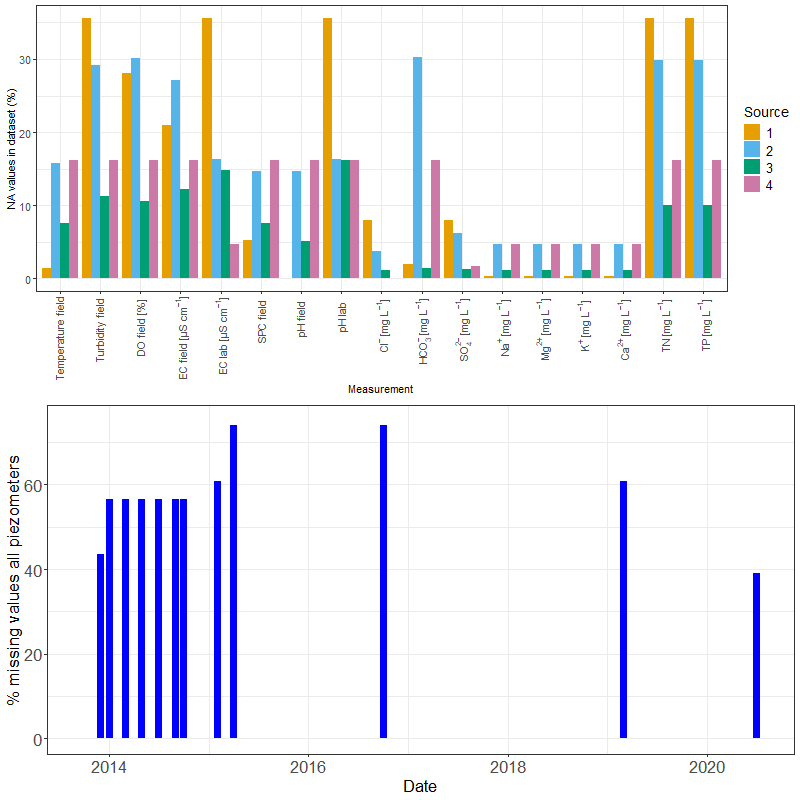
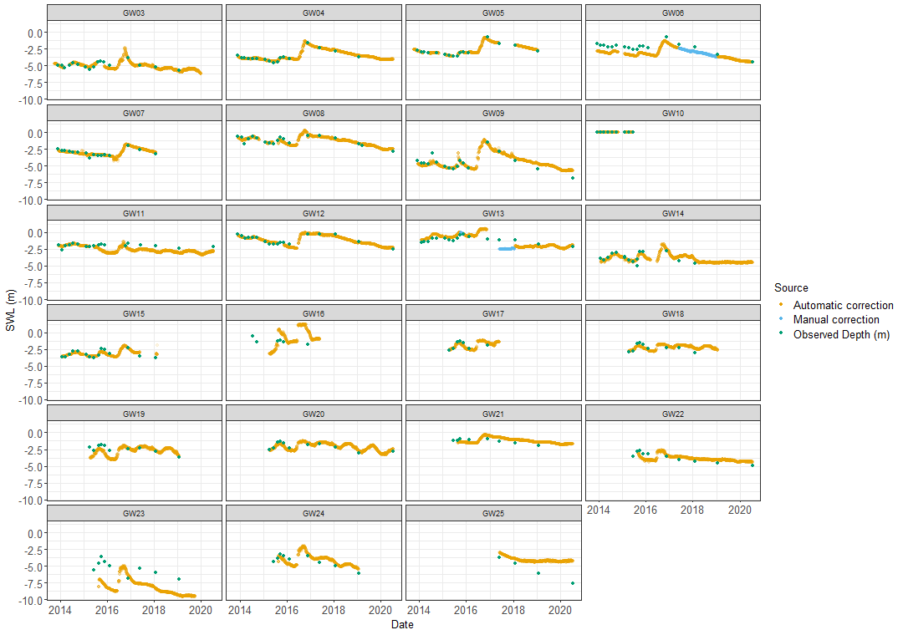

```{r packages, echo=F, warning=F, include=F, message=F}
# knitr::opts_chunk$set(root.dir = '~/GitHub/MuttamaDataPaper/MuttamaDataPaper')
options(tinytex.verbose = TRUE)


require(knitr)
require(bookdown)
require(pander)
require(tidyverse)
require(ggpubr) # saving ggplot figures
library(kableExtra) ##table formatting package
require(multirow)
require(caption)
library(sf)
#library(rgdal) # check if spatial stuff still works
#library(graphics) #needed?
library(raster)
library(ggspatial)
library(ggrepel)
library(ggcorrplot)
library(gridExtra)

theme_set(theme_bw()) # ggplot theme
# define colour palette colour blind friendly
cbPalette <- c("#E69F00", "#56B4E9", "#009E73", "#CC79A7", "#F0E442", "#0072B2", "#D55E00","#999999")


```

```{r data-read, echo = F, message = F, warning = F}
# Read in the streamflow data
coolac<-read_csv('Data/coolac.csv')
coolac <- coolac %>%
  mutate(Date = ymd_hms(`#Timestamp`))%>%
  mutate(Date = date(Date))%>%
  rename(Flow = Value)%>%
  dplyr::select(Date, Flow)

##read in Muttama water quality data data
Muttama_data<-read_csv("Data/MuttamaWaterQuality-Publish_2025.csv")
Muttama_data<-Muttama_data%>%
  mutate(datetime = dmy_hm(datetime)) %>%
  mutate(Month = month(datetime),
          Year = year(datetime),
          Date = date(datetime),
          gw_or_sw = substr(record_id,14,15),
          src = replace_na(src,1),
          site_code = substr(record_id,14,17))
time_period <- max(Muttama_data$Year) - min(Muttama_data$Year)


## Groundwater level data (summarised to daily and corrected)
GW_data <- read_csv("Data/Muttama_piezometer_output.csv") %>%
  mutate(datetime = ymd(Date)) %>%
  mutate(Month = month(datetime),
          Year = year(datetime),
          Date = date(datetime),
          gw_or_sw = "GW",
          site_code = Piezo,
         site_m = as.integer(substr(Piezo,3,4)))
  
# Rainfall data
rainfall<-read_csv("Data/Cootamundra_rainfall.csv")
rainfall <- rainfall %>%
   mutate(Date = ymd(paste(Year,Month,Day, sep = "-"))) %>%
  filter(Year > 2009 & Year < 2025)
  


# include the coordinates for the sample data
coord <- read_csv("Data/SiteList.csv")
coord <- coord %>%
   mutate(site_m = substr(site_longname,3,4),
          site_code = substr(site_longname,1,4))%>%
   transform(site_m = as.integer(site_m))
Muttama <- left_join(Muttama_data, coord, 
                     by = c('site_code','site_mut'), 
                     copy = T)

#identify source 4 in the data
Muttama <- Muttama %>%
  mutate(src = ifelse(str_detect(Muttama$record_id,"_AS")==T,4,src))

# correct watertype 3 to 2 for autosamplers
Muttama <- Muttama %>%
  mutate(water_type = ifelse(str_detect(Muttama$record_id,"_AS")== T, 2,
                             water_type))

Muttama_gw <- left_join(GW_data, coord, 
                     by = c('site_code', 'site_m'), 
                     copy = T)

#Combine flow data with water quality data
Muttama_joined <- left_join(Muttama , coolac, by = "Date") %>%
  dplyr::select(Date,Flow, src)

```
# Introduction

<!--setting the scene-->

Dryland and irrigation salinity has long been a major natural resource management concern in Australia [@Jolly2001; @White2009; @Scanlon2007; @Walker2002; @Finlayson2010]. Globally, the success of management of salinity, while extensively documented, has remained patchy [@Leblanc2012]. As a result, in Australia, the volume of research and number of publications in this area has decreased significantly in recent years (Figure \ref{fig:SalinityPapers}). This is partly due to the effect of the millenium drought on groundwater levels and the consequent reduction in the appearance of salinity effects in the landscape [@mcfarlane2016]. However, the reduction in research is also because of the increased understanding that salinity processes are more complex than previously recognised. For example, salinity processes can vary substantially across the landscape [@Conyers2008] and the processes of salt delivery to the stream also varies in the landscape [@Summerell2006; @Hughes2007] and is dependent on landscape characteristics [@vanDijk2008; @Dalhaus2010]. As a result, the investment required to improve the understanding and increase the effectiveness of management is considerable and this has resulted in a reduction of the number of studies after the large investment in the late 1990s and 2000s in Australia.

Dryland salinity also remains a global problem [@thorslund_vanvliet2020; @stavi2021; @mcfarlane2016]. In particular, the impact of salinity on freshwater systems such as wetlands is recognised as a serious threat [@canedoarguelles2016_science]. More importantly, in this case it is recognised that not only total salt concentration, using the often reported electrical conductivity (EC, such as in the global database from Thorslund and van Vliet [-@thorslund_vanvliet2020]), is of importance, but the actual different chemical species, such as types of cations, as they have different impacts on ecology [@canedoarguelles2016_science].

```{r papers, echo = F, eval = F, warning = F, message = F}
dry<-read_csv("Data/dryland salinity papers.csv")%>%
  dplyr::rename(Year='Publication year')%>%
  dplyr::rename(Papers='Number of Papers')

dry%>%
  dplyr::select(Year,Papers)%>%
    ggplot(aes(Year,Papers)) + geom_col(fill='slateblue3') +theme_classic2() +xlab('Year of Publication') + ylab('Number of Papers')
ggsave('Figures/Dryland Salinity Papers.png',dpi=300)

```

```{r SalinityPapers, echo=F, fig.cap = "Number of papers on the Web of Science related to the search terms (Dryland Salinity) AND Australia, 1980 - 2022", out.width="80%"}

#Dryland Salinity Papers.rmd
```

The poor spatial and timescale distribution of water quality datasets has long been an obstacle to measuring trends in salinity. Studies such as Jolly et. al. [-@Jolly2001] and White et. al [-@White2009] used large historical datasets to detect broadscale trends over large periods throughout the Murray Darling Basin (MDB). This work identified that southern and eastern dryland regions in the Murray Darling Basin have rising salinity trends that were worse in areas of low rainfall [@White2009; @Jolly2001]. However, the ion composition varied greatly throughout the Murray Darling Basin (MDB) [@White2009]. More specifically, Conyers et al. [-@Conyers2008] tried to isolate which areas in the middle portion of the Murrumbidgee catchment acted as sources of salinity, as well as whether this was predominantly marine cyclic salts (NaCl) as previously assumed, or whether salts from mineral weathering were also involved (e.g. Ca, Mg, HCO~3~). While both are captured in the bulk measurement of electrical conductivity (EC), a rise in marine cyclic salts can be a major source of osmotic stress, whereas mineral weathering salts are far less harmful and are more likely to precipitate at reasonably low concentrations [@Conyers2008]. The ratio of Cl:HCO~3~ ions was identified as the best indicator of the source of salinity, with Cl^-^ acting as a measure of marine cyclic salts and HCO~3~^-^ acting as a measure of mineral weathering salts. The Muttama catchment was specifically identified as a candidate for future research as ion concentrations appeared to result in a change from east to west, correlating with the underlying geology and their mineral composition.

<!-- defining the need for detailed data -->

It is clear from these examples that detailed spatial and temporal datasets are key to understanding different hydrogeochemical processes in the landscape [e.g. @Cartwright2010; @Dalhaus2010], but overall publicly available datasets on dryland salinity in Australia remain limited to detailed data from small experimental catchments (\< 100 ha) [@Summerell2006; @crosbie2007;  @Hughes2007] or sparse government datasets from official monitoring (i.e. [WaterNSW WaterInsights platform](https://waterinsights.waternsw.com.au/)) which tend to be limited in hydrogeochemical data. Part of this is related to the sensitivity of the data given the relationship with possible land values. However, as the understanding of salinity occurrence grows, this argument is less valid. Making data more widely available would increase the opportunities for research and increase our understanding of dryland salinity processes.

<!--Some examples of spatial sampling-->

Without regular and expensive automated sampling, field campaigns to collect water quality data tend to be "snapshot" activities [@Grayson1997; @Breuer2015; @Lyon2008; @Cartwright2010; @Lintern2018] which can be biased due to the over representation of low flow conditions [@Lessels2020]. Even the analyses of substantial government databases [@Lintern2018] are likely to be biased in this way. This means that overall there are limited streamflow and groundwater salinity data sets that combine multiple locations across a significant time period and that combine a range of flow characteristics.

<!--aims-->

The aim of this paper is to present and describe the space time dimensions and basic relationships of a complex groundwater and surface water hydrogeochemistry dataset that was collected over a `r time_period` year period in a 1000 km^2^ agricultural catchment in New South Wales, Australia. The Muttama catchment, which is the focus of this paper, provides a microcosm of groundwater and surface water salinity variability in Australia. Focusing on a medium size catchment in greater detail creates opportunities to test whether sources of salinity can be traced back to specific areas of land.
The Muttama catchment is representative of flat semi-arid catchments globally, but especially of Australian catchments, where a significant amount of research has taken place at the catchment scale [e.g. @crosbie2007; @Hughes2007; @hughes2008; @Summerell2006]. Unfortunately, a lot of the older data is not easily accessible and extractable. This paper attempts to correct this by providing an open dataset, which hopefully will also encourage other research teams to summarise and report open data.
We believe that the data would be relevant for semi-arid areas in the US, Canada, Asia and South America [@thorslund_vanvliet2020; @stavi2021].


This paper gives a description of the dataset to facilitate open access of the dataset, but does not analyse the physiochemical relationships in the data in detail. This will be analysed in follow-up papers and was partly analysed in an earlier thesis [@Akter2018]. The main aim of this paper is to make the data set accessible to other researchers to encourage further research in this catchment and in salinity in general.

# Methods

## Muttama catchment

The 1000 km^2^ Muttama creek catchment (Figure \ref{fig:samplemap}) is located in the Mid-Murrumbidgee catchment area of NSW in south eastern Australia. The landscape is undulating with elevation variations ranging from 227 - 719 m. Muttama creek flows north-south through the length of the catchment towards the Murrumbidgee River near Gundagai. The main township, Cootamundra is located in the upper half of the catchment. The dominant land use type of this catchment is about 93\% agriculture, dominated by winter-spring cropping and pasture. Mean annual rainfall (1891-2024) in the catchment is 654 mm for the longest running Bureau of Meteorology Landgrove station (station 073022), while potential evapotranspiration far exceeds this total.

Streamflow is measured continuously by WaterNSW, the state agency responsible for water data collection, at three locations in the catchment: Coolac, station no. 410044, the main downstream point, and Berthong, station no. 41000207 and Jindalee, station no. 410112 on two branches above the Cootamundra township. These data are available as open access via the [WaterNSW WaterInsights platform](https://waterinsights.waternsw.com.au/) or through the [Bureau of Meteorology](http://bom.gov.au/waterdata/). Here, we only use the data from the Coolac station as a comparison.


```{r mapping-basic, echo = F, eval = F}
# !! warning: 5m DEM means you need substantial memory on your computer to regenerate this map !!
##read in shapefile
Muttama_catchment<-sf::st_read("Data/GIS/MuttamaCatchmentAtCoolac2.shp")
st_crs(Muttama_catchment) = 4283
# this is Australia WGS84 Lambert
#plot(coolac)
streams<-sf::st_read("Data/GIS/MuttamaStreams2.shp")
streams <- st_transform(streams, 4283)
# the DEM is not provided with the data due to its size
# it can be downloaded freely from the following website: https://elevation.fsdf.org.au/, accessed 12/09/2024
DEM_Coolac <- raster("../../../../Muttama Dataset Analysis/GIS/DEM_clippedToCatchment2.tif")
#DEM_Coolac <- raster("/Users/alexbuza/Downloads/1_Second_DEM_Smoothed_199362/1_Second_DEM_Smoothed.tif")
DEM_Coolac <- mask(DEM_Coolac, Muttama_catchment)
names(DEM_Coolac) <- "DEM_clippedToCatchment2"
# # following https://rdrr.io/cran/ggspatial/man/layer_spatial.Raster.html
DEM_Coolac_df <- as.data.frame(DEM_Coolac, xy=T)

Muttama_labels <- Muttama %>%
  dplyr::select(x, y, site_m, gw_or_sw) %>%
  distinct() %>%
  drop_na() 

max_sw_site <- max(Muttama_labels$site_m[Muttama_labels$gw_or_sw == "SW"])

Muttama_labels <- Muttama_labels %>%
  mutate(site_m2 = ifelse(gw_or_sw == "GW", site_m + 
                           max_sw_site, site_m))

#gw or sw map
map <- ggplot() + geom_sf(data=Muttama_catchment,
                               colour = "black", fill = NA)  +
       geom_sf(data = streams,
               colour = "darkblue", fill =NA) +
      geom_raster(data = na.omit(DEM_Coolac_df),
                 aes(x=x,y=y,fill=DEM_clippedToCatchment2),
                 alpha=0.2) +
 scale_fill_gradientn(name = "Elevation [m]", colors=terrain.colors(25)) +
  #ylim(c(-35,-34.5)) + xlim(147.85,148.3)+
  #geom_point(data=Muttama,aes(x,y,colour=factor(gw_or_sw),shape=factor(gw_or_sw))) +
  # coord_equal() + #keep axes equivalent
  xlab("Longitude") + ylab("Latitude")+
  # geom_text(data=Muttama,aes(x,y,label=as.character(Muttama$site_m),
  #                            colour=factor(gw_or_sw)), key_glyph = "rect") +
  geom_point(data=Muttama_labels,
                 aes(x, y,
                     colour=factor(gw_or_sw),shape=factor(gw_or_sw))) +  #  labs(colour="Source") +
  geom_text_repel(data=Muttama_labels,
                 aes(x, y,
                     label=as.character(site_m2),
                     colour = factor(gw_or_sw)),
                 key_glyph = "rect",
                 force = 1,
                 min.segment.length = 0,
                 nudge_y = sample(c(-1, 1), nrow(Muttama_labels), 
                                  replace = TRUE) * 0.02,
                 nudge_x = sample(c(-1, 1), nrow(Muttama_labels), 
                                  replace = TRUE) * 0.02) +
  # scale_shape_manual(name = 'Type',
  #                    values = c(16, 17),
  #                    labels=c('GW','SW')) +
  # scale_colour_manual(name = 'Type',
  #                     values=c("#0072B2", "#D55E00"),
  #                     labels=c('GW','SW')) +

   scale_colour_manual('Type',values=c("#0072B2", "#D55E00"),
                       labels=c('GW','SW')) +
    scale_shape_manual('Shape', values = c(16, 17), labels=c('GW','SW')) +
  # labs(fill = "Source") +
  theme_bw() 
#map

# map
ggsave("Figures/gw_or_sw_map.png", unit="cm", dpi = 300)
```


```{r samplemap, echo=F, fig.cap = "Muttama Catchment Sampling Locations with Elevation. Symbol colour indicates whether location was a groundwater or surface water source, with blue being surface water and coral red being groundwater. The numbers on the map represent the sample location number.", out.width="80%"}
knitr::include_graphics("Figures/gw_or_sw_map.png")
#Muttama_maps.rmd
```

The depth to the nearest groundwater table varies across the Muttama catchment and it ranges from \< 2 m to 20 m below ground level [@DECC2009]. Deep groundwater in the catchment occurs mostly in fractured rock aquifers common on the eastern, and western fringes of the catchment. In contrast, shallow groundwater is associated with unconfined alluvial, colluvial, and eluvial aquifers. Some aquifers in the northern part of this catchment show artesian behavior [@Webb1999; @Akter2018].

Saline areas of the catchment tend to be associated with geological heterogeneity, primarily the sedimentary materials in the west and rhyolite on the northwest side [@Conyers2008]. Overall, Muttama creek is a significant salt contributor to the downstream Murrumbidgee river with suggested contributions of around 58\% from cyclic sources and 42\% salts originating from mineral weathering [@Conyers2008].

## Data Collection

### Data Sources

The water quality dataset contains data from 4 main sampling sources related to four distinct groups of "people" doing the sample collection. The term "people" is used loosely, as it mainly related to four different types of sampling campaigns, which potentially had differences in the rigour of the sampling campaign (quality control, types of samples taken, training of the people taking the samples). These groups are designated as:

-   Source 1: Data from the PhD study by Akter [-@Akter2018].

-   Source 2: Data from the sampling campaign of two former students, the PhD from Lessels [-@Lessels2014] and unpublished data from another student, E. Milne.

-   Source 3: A dataset collected by undergraduate and postgraduate students as part of field trips in different units of study at the University of Sydney is identified as "Student data". This data was sampled "ad-hoc" during the field trip period using standard sampling protocols as described for the data from Akter [-@Akter2018].

-   Source 4: Data from several autosamplers installed in the catchment during the PhD from Lessels [-@Lessels2014]. Because these samples were not taken by a "person" and were taken on a flow weighted basis, we separated the data from the "grab" samples in the other methods. These samples are also missing field measurements, as these were only analysed in the laboratory.

Overall, `r nrow(Muttama)` water samples were collected from `r nrow(coord)` sample locations over the `r year(min(Muttama$Date))` - `r year(max(Muttama$Date))` period. However, not all sites were sampled at all times and not all samples were fully analysed for all hydrogeochemical variables. Both surface water and groundwater samples were collected at `r nrow(coord %>% filter(str_detect(coord$site_code,"GW")==T))` groundwater sample sites and `r nrow(coord %>% filter(str_detect(coord$site_code,"SW")==T))` surface water sites. These are distributed across the catchment, depending on standing water availability and access.

In addition to the water quality dataset, data from `r nrow(coord %>% filter(str_detect(coord$site_code,"GW")==T))` groundwater data loggers is provided from the same groundwater sample sites as in the hydrogeochemical dataset.

### Hydrogeochemical Variables

The overall structure of the hydrogeochemical dataset consists of repeated measurements over time at multiple locations in Muttama catchment. For each location the name of the location and the spatial coordinates were recorded in decimal degrees (Longitude = x and Latitude = y) as well as whether the location was a groundwater or a surface water location. The names of the locations are fairly random and basic locality indicators, which cannot be interpreted exactly.

The data for each location consist of up to six variables which were measured in the field (Table \ref{tab:TableMeasurements}). These were complemented by laboratory analysis, which repeated some of the field measurements, and for additional major anion and cation variables (Ca, Mg, Na, K, Cl, SO~4~, HCO~3~), and total Nitrogen (N) and total Phosphorus (P) for part of the sample set. Some other variables were infrequently measured and are not included in the data set.

<!-- reviewer wants to see an overview of samples per element -->
```{r TableMeasurements, echo=F, warning=F, include=T, message=F}
field<-c('pH','EC (Electrical conductivity)', 'SPC (temperature corrected EC)', 'Temperature', 'Dissolved Oxygen (DO)', 'Turbidity')
#lab <- read_csv('Data/lab.csv')
table_M <- tibble(`Field measurements` = field, 
                  `Records Field` = c(length(na.omit(Muttama_data$ph_field)),
                                      length(na.omit(Muttama_data$ec_field)),
                                      length(na.omit(Muttama_data$spc_field)),
                                      length(na.omit(Muttama_data$temp_field)),
                                      length(na.omit(Muttama_data$do_percent_field)),
                                      length(na.omit(Muttama_data$turbidity_field))),
                  `Lab repeat` = c('pH','EC', rep('',4)),
                  `Records Lab` = c(length(na.omit(Muttama_data$ph_lab)),
                                      length(na.omit(Muttama_data$ec_lab)), rep('',4)),
                  `Anions` = c('Cl$^-$', 'HCO$_3^-$','SO$_4^{2-}$', rep('',3)),
                  `Records Anions`  = c(length(na.omit(Muttama_data$cl_mg_l)),
                                      length(na.omit(Muttama_data$hco3_mg_l)),
                                      length(na.omit(Muttama_data$so4_mg_l)),  rep('',3)),
                  `Cations` = c('Na$^+$', 'Mg$^{2+}$', 'K$^+$', 'Ca$^{2+}$', rep('',2)),
                  `Records Cations`  = c(length(na.omit(Muttama_data$na_mg_l)),
                                      length(na.omit(Muttama_data$mg_mg_l)),
                                      length(na.omit(Muttama_data$k_mg_l)),
                                      length(na.omit(Muttama_data$ca_mg_l)),rep('',2)),
                  `Other` = c('Total Nitrogen', 'Total Phosphorus',rep('',4)),
                  `Records other`  = c(length(na.omit(Muttama_data$tn_mg_l)),
                                      length(na.omit(Muttama_data$tp_mg_l)),rep('',4))
                  ) 
knitr::kable(table_M, "latex", caption = "Variables measured in the field and laboratory.", escape=FALSE) %>% kable_classic(latex_options = "scale_down")

```

The variables pH, EC, SPC (specific conductance: field temperature corrected EC), Temperature, and in some cases dissolved oxygen (DO) and Turbidity were measured using a range of field probes (Table \ref{tab:TableInstruments}). All field probes measured pH, EC, Temperature and calculated SPC. Early measurements (samples up to November 2014) used a YSI probe that included a turbidity and DO probe (YSI 6600 and YSI 600 for surface and groundwater, respectively). Later groundwater samples (After November 2014) used a different YSI probe (YSI ProDSS multi-parameter) that only included a DO probe, while the suface water sampling used a YSI EXO2 multiparameter sonde that included pH, EC, DO and Turbidity. Finally, (after mid 2019) surface water and groundwater sampling used a Xylem Exo probe with DO, pH, EC, Temperature and SPC. Some of the variability in the field measurements might be due to this variation in the field instrumentation. 


```{r TableInstruments, echo=F, warning=F, include=T, message=F}
table_I <- read_csv("data/Muttama_WQInstrument_Table.csv") %>%
  dplyr::select(Instrument, Purpose, Date, Sensors)


# table_I <- tibble(Instrument = c('YSI 6600', 'YSI 600', 'YSI ProPlus multi-parameter',
#                                  "Xylem Exo Probe", "Xylem Exo Probe"),
#                   Purpose = c("Surface water", "Groundwater", "Groundwater", "Surface water", "Groundwater"),
#                   Sensors = c("pH, EC, Temperature, turbidity, DO", "pH, EC, Temperature, turbidity, DO", "pH, EC, Temperature, DO", "pH, EC, Temperature, DO", "pH, EC, Temperature, DO"),
#                   Date = c('up to November 2014', 'up to November 2014', 'after November 2014', 'after mid 2019', 'after mid 2019'))
kableExtra::kbl(table_I, "latex", caption = "Different instruments used in the sampling.", escape=FALSE) %>% column_spec(1, bold=T) %>%
collapse_rows(columns = c(1:3),row_group_label_position = "first") %>% 
  kable_styling(latex_options = "scale_down")
```


Anions in most of the samples were analysed using the high-performance liquid chromatography method (Dionex P680 HPLC) and cations were measured on acidified samples using an Inductively Coupled Plasma Optical Emission Spectrometer (ICP-OES, Varian 720-ES) at the University of Sydney [@Akter2018]. Duplicate samples in the analysis had a reported relative percentage difference (RPD) lower than 5\% in part of the sample dataset [@Akter2018]. Some of the later samples and the student sample set (Source 3) were analysed by a commercial laboratory ([ALS Environmental, Smithfield, NSW](https://www.alsglobal.com/en/locations/asia-pacific/pacific/australia/nsw/sydney-woodpark-environmental)). Alkalinity concentrations were generally measured in the field within 24h of collection using a HACH digital titrator (model 16900) [@Akter2018] up to 2017 and by the commercial laboratory after this.

The hydrogeochemical data is stored on the University of Sydney escholarship repository: [doi.org/10.25910/m0wp-8890](doi.org/10.25910/m0wp-8890)

## Continuous variables

The logger data, which early on collected groundwater pressure levels at 15 min and from mid-2016 at 2 hour intervals, were adjusted for the length of the cable and the height of the standpipe above the ground level. They were subsequently summarised to raw daily values using an R script (`SummariseDailyData.R`), which is stored with the raw data in the Open Science Foundation (OSF) repository associated with this paper [https://doi.org/10.17605/OSF.IO/BEUWK](https://doi.org/10.17605/OSF.IO/BEUWK).

The loggers in the field were uncalibrated. Due to logger failures, gaps occur in the daily data, followed by replacement of the faulty loggers. In some cases the cable length was adjusted and this was recorded in the field notes. Overall, this resulted in data with gaps and sometimes shifts in the recorded logger data.

Manual water level measurements were taken at each manual sampling date to allow calibration of the logger data. To correct the groundwater logger data, the daily data was matched to the observed data using linear regression, if more than 3 manual observed data were available and slope and intercept of the regression had a p-value \< 0.1. If there were less than 3 manual observed data points for the specific logger an adjustment to the data was based on the difference between the average observed data and the average recorded water levels. Otherwise no adjustment was made. After the manual observations are made, the well is purged and the logger is temporarily removed from the well. This data (during the temporarily removal of the logger during the purging and subsequent recovery of the groundwater level) is removed from the logger data series. As a result, there is no direct time match between the logger data series and the manual observations. However, the data showed that, in most cases, the groundwater level recovered within 24 hrs. The pseudo code in the supplementary material describes the process in more detail.

The code used to match the manually observed data with the logger data is in the script `Match_obs_logger_data.R`, which is stored with the raw data in the Open Science Foundation (OSF) repository associated with this paper [https://doi.org/10.17605/OSF.IO/BEUWK](https://doi.org/10.17605/OSF.IO/BEUWK).

After the automated process, two of the groundwater level data series still had substantial discrepancies in some sections of the data. This was most likely due to a lack of observed data for the specific logger. A final manual correction was applied. As this process is based on judgement of the data by the authors of this paper, we documented this in detail in the supplementary material.

The final corrected data that is published with this paper on [https://doi.org/10.17605/OSF.IO/BEUWK](https://doi.org/10.17605/OSF.IO/BEUWK) includes a column which describes whether the data is based on the automatic correction or a further manual correction.


\clearpage

## Boxplots and maps

Using the most complete data, boxplots and spatial maps were generated to highlight the spatial and temporal variation in the data set. The boxplots visually highlight empirical differences in the data.

The mean concentration and interquartile range (25^th^ - 75^th^ percentile) of the concentration data distributions were calculated to give an indication of variation of the data in the spatial maps.

All graphs and maps were produced using R version 4.3.1 [@R2023]. All code can be found in the associated [github repository](https://github.com/WillemVervoort/MuttamaDataPaper), as part of the markdown document for this paper.

# Results

## Distribution of missing Values

```{r NAcount, echo = F, eval = F}
# Rename
measurement_relabel <- c(
  "Temperature~field" = "temp_field",
  "Turbidity~field" = "turbidity_field",
  "DO~field~'[%]'" = "do_percent_field",
  "EC~field~'['*µS~cm^{-1}*']'" = "ec_field",
  "EC~lab~'['*µS~cm^{-1}*']'" = "ec_lab",
  "SPC~field" = "spc_field",
  "pH~field" = "ph_field",
  "pH~lab" = "ph_lab", 
  "Cl^{-''}*~'['*mg~L^{-1}*']'" = "cl_mg_l",
  "HCO[3]^{-''}~'['*mg~L^{-1}*']'" = "hco3_mg_l",
  "SO[4]^{2-''}*~'['*mg~L^{-1}*']'" = "so4_mg_l",
  "Na^{+''}*~'['*mg~L^{-1}*']'" = "na_mg_l",
  "Mg^{2+''}*~'['*mg~L^{-1}*']'" = "mg_mg_l",
  "K^{+''}*~'['*mg~L^{-1}*']'" = "k_mg_l",
  "Ca^{2+''}*~'['*mg~L^{-1}*']'" = "ca_mg_l",
  "TN~'['*mg~L^{-1}*']'" = "tn_mg_l",
  "TP~'['*mg~L^{-1}*']'" = "tp_mg_l"
)

Muttama_na<- Muttama %>%
  dplyr::select(src,temp_field:k_mg_l) %>%
  group_by(src) %>%
  summarise_all(list(~sum(is.na(.)/nrow(Muttama))*100))

Muttama_na_plot <- Muttama_na %>%
  pivot_longer(temp_field:ncol(Muttama_na), 
               names_to = "Measurement", 
               values_to = "Number_NA") %>%
  mutate(Measurement = factor(Measurement,
                              levels = measurement_relabel,
                              labels = names(measurement_relabel))) %>%
  arrange(Measurement) %>% 
  ggplot(aes(x = Measurement, y = Number_NA, 
             fill = as.factor(src))) + 
  scale_fill_manual(values = cbPalette) +
  geom_bar(stat="identity", position="dodge") + 
  scale_x_discrete(labels = function(l) parse(text=l)) +
  theme_bw() +
  theme(axis.text.x= element_text(angle=90,size = rel(1.3), hjust = 0.9, vjust = 0.5)) +
  theme(axis.text.y= element_text(size = rel(1.3))) +
  theme(legend.text = element_text(size = rel(1.2)),
        legend.title = element_text(size = rel(1.3))) +
  ylab("NA values in dataset (%)") + labs(fill="Source")
 
#ggsave("Figures/na_count.png", unit="cm", dpi = 300)
```

```{r gw-NA, echo = F, eval = F, warning = F}
#GWdata <- read_csv("../Muttama Dataset Analysis/Data/Muttama_Piezometer_Output.csv")

no_piezo <- length(unique(Muttama_gw$Piezo))

GWdata_NA <- Muttama_gw %>%
  mutate(na_value = ifelse(is.na(`Final GW Depth (m)`)==T,1,0)) %>%
  group_by(Year = year(Date),Month = month(Date)) %>%
  summarise(NA_count = sum(na_value)/no_piezo*100,
            Piezo = unique(Piezo)) 

GWdata_NAplot <- GWdata_NA %>%
  ggplot(aes(ym(paste(Year,Month)), NA_count)) + 
  geom_bar(fill = "blue", stat="identity") +
  ylim(0,75) + theme_bw() + ylab("% missing values all piezometers") +
  xlab("Date") +
  theme(axis.text = element_text(size = rel(1.5)),
        axis.title = element_text(size = rel(1.5)))

#ggsave("Figures/na_GW.png", unit="cm", dpi = 300)

```
```{r NAplots,  echo = F, eval = F, warning = F}
png("Figures/na_count.png", width = 800, height = 800)
grid.arrange(Muttama_na_plot, GWdata_NAplot, nrow=2, ncol = 1)
dev.off()
```


```{r na-plot, warning=FALSE, echo=F, fig.cap = "Top: Distribution of missing values for the different data sources and measurement types. Most of these missing values were because not all the variables were analysed for all the samples, see the explanation in the article text. Bottom: Percent missing values for the groundwater data across all piezometers, summarised by month.", out.width="90%"}


#Muttama_NA_count.rmd
```

<!--
\clearpage
-->

In the hydrogeochemistry data, data source 3 was the most complete in terms of variables analysed, because in this set more variables were analysed in the commercial lab (Figure \ref{fig:na-plot} top). Some of the variables analysed in the commercial lab were not analysed with the equipment at the University of Sydney. However, source 3 had the smallest number of overall samples. Source 2 has the most incomplete data points. Source 4 has a very consistent number of missing values, possibly because not all samples were analysed in the set. For source 2, the missing data suggests that for many of the samples only a few of the variables were measured and analysed as highlighted above. In the data from source 2, almost 50% of samples are incomplete in terms of the measurement of all the variables in Table 2. Similarly, source 1 had more incomplete data, because some of the minor elements were not analysed. The field recorded variables pH, EC, SPC and Temperature were the most complete as they were generally measured directly in the field. Thus the distribution of the NA values in the overall data set is mostly a reflection of the time period of sampling and the change in methodology over the `r time_period` years of sampling.

In the groundwater level time series, the missing data relate mostly to logger failures and the different times that wells were instrumented. Rather than giving a full breakdown by well location, the overall level of completeness of the series is displayed (Figure \ref{fig:na-plot} bottom).

## Temporal Distribution of Data


```{r derive-month-plot, echo = F, eval = F}
##add rainfall data
rainfall_month <- rainfall %>% 
                group_by(Year, Month) %>%
                summarise(Rainfall = sum(`Rainfall amount (millimetres)`,na.rm=T)) %>%
  group_by(Month) %>%
  summarise(Rainfall = mean(Rainfall))

Muttama_monthly <- Muttama %>%
  ggplot(aes(Month)) + geom_bar(aes(fill = as.factor(src))) +
  geom_smooth(data = rainfall_month ,aes(Month, Rainfall), se = F) +
  ylab("Number of samples") + labs(fill = 'Source') +
  scale_x_continuous(breaks = seq(1,12,1)) +
  scale_y_continuous(sec.axis = sec_axis(~., name = "Monthly rainfall [mm]")) +
  scale_fill_manual(values = cbPalette) +
  theme(axis.text = element_text(size = rel(2)))
#ggsave("Figures/monthly.png", unit="cm", dpi = 300)

```

<!--
\clearpage
-->
Overall the water quality sampling appears to have a reasonable distribution across all months (Figure \ref{fig:timedist-plot}), therefore seasonal trends should be identifiable in the data. Average rainfall data (1995 - 2022) does not indicate any major seasonal trends, although there is a slight dominance of rainfall in the early Austral Spring (months 9 and 10, September and October). This also explains the higher number of samples because, more sampling trips were organised in this period, and spatially more channels could be sampled for surface water. The timing of source 3 (the student data) is the result of the yearly field trips, which tended to occur at approximately the same time of the year in early March and late September or early October, coinciding with the University semester breaks.


```{r annual-plot-derive, echo = F, eval = F}
Muttama_annual <- Muttama%>%
  ggplot(aes(Year)) + geom_bar(aes(fill = as.factor(src))) + xlab("Year") +
  ylab("Number of samples") + labs(fill="Source") + theme_bw() +
  scale_fill_manual(values = cbPalette) +
  theme(axis.text = element_text(size = rel(1.5)),
        axis.title = element_text(size = rel(1.5), family = "bold"))
#ggsave("Figures/annual.png", unit="cm", dpi = 300)
png("Figures/timeDist.png", width = 800, height = 800)
grid.arrange(Muttama_monthly, Muttama_annual, nrow=2, ncol = 1)
dev.off()

```

```{r timedist-plot, warning=FALSE, echo=F, fig.cap = "Top:Distribution of samples throughout the year (total number of samples collected during each month) with the blue line representing the average monthly rainfall during the study period. Bottom: Distribution of samples over the study period (total number of samples collected during each year).", out.width="70%"}


knitr::include_graphics("Figures/timeDist.png")

#Muttama_Time.rmd
```

The number of samples collected in each year relative to the different sources changes throughout the years reflecting the duration of the different studies and funding cycles (Figure \ref{fig:timedist-plot}); however the data is still well-distributed enough that overall trends should be clear. In addition, some of the sample volumes can be related to the occurrence of rainfall, as in drier years several of the channels would be dry and no sampling of surface water could occur.

Consistent groundwater sampling commenced later in the project, which means that there are very few groundwater samples before 2013. In contrast, the autosamplers were installed early in the project and there are no samples from this source after 2013.

```{r FDC-derive, echo = F, eval = F}
#Join the flow data with the water quality data

## Flow duration curve for Coolac
n <- nrow(na.omit(coolac))
Q_sort <- coolac %>%
          na.omit() %>%
          arrange(desc(Flow))
rank_coolac <- 1:n
Prob_coolac <- rank_coolac/(n+1)
coolac_df <- data.frame(Probability=Prob_coolac*100, Flow=Q_sort$Flow)

# do the same for the water quality data
Muttama_df <- Muttama_joined %>%
  group_by(Date) %>%
    summarise(n=n(),
    Flow = mean(Flow), src = unique(src))%>%
    ungroup() %>%
  arrange(desc(Flow))
# join on probabilities
Muttama_prob <- left_join(Muttama_df, coolac_df)
#Finally we can make the plot
coolac_df %>%
  ggplot(aes(Probability,Flow)) +
  geom_line(colour="#999999", linewidth = 2) +
  geom_point(data=na.omit(Muttama_prob),
             aes(Probability, Flow, alpha = 0.5, size = n,colour= as.factor(src))) + 
  theme_bw() +
  ylab(expression(Streamflow~'['*m^3~s^{-1}*']')) + xlab("Probability of exceedance") +
  # scale_y_log10() +
  scale_y_continuous(trans = "log10",
                     breaks = 10^(-3:2),
                     labels = scales::label_log()) +
  scale_alpha_continuous(guide='none') +
  scale_colour_manual(name = 'Source', values = cbPalette) 
  #labs(colour = 'Source')

ggsave("Figures/FDC.png", unit="cm", dpi = 300, width = 12, height = 9)  

```

```{r FDC, warning=FALSE, echo=F, fig.cap = "Sample distribution on flow duration curve derived from flow data at the Coolac NSW government station.",  out.width="80%"}

knitr::include_graphics("Figures/FDC.png")

#Muttama_FDC.rmd
```

Surface water samples were reasonably well distributed across the flow distribution, measured at the Coolac station (410044), with only a possible bias towards periods of medium flow. This is most likely since many of the upstream surface water sampling points are often completely dry during periods of low flow at Coolac, and therefore cannot be sampled. Conversely, there are no manual samples during high or very high flow as during flood situations sampling was dangerous and restricted by work health and safety considerations. The samples at high flow are all from our automated sampling.

### Comparisons of the geochemistry of groundwater samples with Surface water samples


```{r warning=FALSE,echo=FALSE,message=FALSE}

##GW
Muttama_sum<- Muttama_data %>%
  select_at(vars('gw_or_sw',temp_field:k_mg_l))%>%
  subset(gw_or_sw=='GW')%>%
  group_by(gw_or_sw)%>%
  summarise_all(funs(mean,min,max),na.rm=T) 

means <- Muttama_sum %>%
  gather(key = "element", value="Mean", ends_with("mean")) %>%
  dplyr::select(element,Mean) %>%
  mutate(Mean = round(Mean,1))
mins <- Muttama_sum %>%
  gather(key = "element1", value="Min", ends_with("min")) %>%
  dplyr::select(element1,Min)%>%
  mutate(Min = round(Min,1))
max <- Muttama_sum %>%
  gather(key = "element2", value="Max", ends_with("max")) %>%
  dplyr::select(element2,Max) %>%
  mutate(Max = round(Max,1))
muttama_statGW<-cbind(means,mins,max)%>%
              mutate(element=substr(element,1,nchar(element)-5))%>%
              dplyr::select(c(element,Mean,Min,Max))%>%
              # mutate_if(is.numeric,round,1) %>%
  mutate(Min = ifelse(Min == Inf | Min == -Inf, NA, Min),
         Max = ifelse(Max == Inf | Max == -Inf, NA, Max),
         Mean = ifelse(is.na(Mean), NA, Mean)) %>% 
  mutate(across(where(is.numeric),
              ~ifelse(means$element %in% c("spc_field_mean",
                                           "ec_field_mean",
                                           "ec_lab_mean"),
                      sprintf("%.0f", .x),
                      sprintf("%.1f", .x))))


##SW
Muttama_sum<- Muttama_data %>%
  select_at(vars('gw_or_sw',temp_field:k_mg_l))%>%
  subset(gw_or_sw=='SW')%>%
  group_by(gw_or_sw)%>%
  summarise_all(funs(mean,min,max),na.rm=T) 

means <- Muttama_sum %>%
  gather(key = "element", value="Mean", ends_with("mean")) %>%
  dplyr::select(element,Mean) %>%
  mutate(Mean = round(Mean,1))
mins <- Muttama_sum %>%
  gather(key = "element1", value="Min", ends_with("min")) %>%
  dplyr::select(element1,Min) %>%
  mutate(Min = round(Min,1))
max <- Muttama_sum %>%
  gather(key = "element2", value="Max", ends_with("max")) %>%
  dplyr::select(element2,Max)%>%
  mutate(Max = round(Max,1))

muttama_statSW<-cbind(means,mins,max)%>%
              mutate(element=substr(element,1,nchar(element)-5))%>%
              dplyr::select(c(Mean,Min,Max)) %>%
              # mutate_if(is.numeric,round)
              mutate(across(where(is.numeric),
                            ~ifelse(means$element %in% c("spc_field_mean",
                                                         "ec_field_mean",
                                                         "ec_lab_mean"),
                                    sprintf("%.0f", .x),
                                    sprintf("%.1f", .x))))


##combine SW and GW
muttama_stat<-cbind(muttama_statGW,muttama_statSW)%>%
  as.data.frame() 
#write.table(muttama_stat,file='Muttamastat.csv',sep=',',qmethod='double')
measurement_relabel_tex <- c(
  "Temperature field" = "temp_field",
  "Turbidity field" = "turbidity_field",
  "DO field [\\%]" = "do_percent_field",
  "EC field [µS cm$^{-1}$]" = "ec_field",
  "EC lab [µS cm$^{-1}$]" = "ec_lab",
  "SPC field" = "spc_field",
  "pH field" = "ph_field",
  "pH lab" = "ph_lab", 
  "Cl$^-$ [mg L$^{-1}$]" = "cl_mg_l",
  "HCO$_3^-$ [mg L$^{-1}$]" = "hco3_mg_l",
  "SO$_4^{2-}$~[mg L$^{-1}$]" = "so4_mg_l",
  "Na$^{+}$ [mg L$^{-1}$]" = "na_mg_l",
  "Mg$^{2+}$ [mg L$^{-1}$]" = "mg_mg_l",
  "K$^{+}$ [mg L$^{-1}$]" = "k_mg_l",
  "Ca$^{2+}$ [mg L$^{-1}$]" = "ca_mg_l",
  "TN [mg L$^{-1}$]" = "tn_mg_l",
  "TP [mg L$^{-1}$]" = "tp_mg_l"
)


muttama_stat$element <- factor(muttama_stat$element,
                               measurement_relabel_tex,
                               names(measurement_relabel_tex))
muttama_stat <- muttama_stat[order(muttama_stat$element),]
rownames(muttama_stat) <- NULL
```


```{r TableElementstats, echo=F, warning=F, include=T, message=F}
#muttama_stat<-read.csv('../../Muttama Dataset Analysis/Data/Muttamastat.csv')
muttama_stat %>%
  knitr::kable("latex",
               escape = FALSE,
               col.names = c('Element', rep(c('Mean', 'Min', 'Max'), 2)),
               caption='Summary statistics for elements measured in the field.') %>%
  add_header_above(c('', 'GW'=3, 'SW'=3)) %>%
  kable_classic_2(full_width = F)

#Muttama_NA_count
```

The summary of the samples (Table \ref{tab:TableElementstats}) highlights the range of the data for the different variables. Obviously, surface water will record higher DO values, while groundwater recorded higher EC and SPC values. The rest of the variables have fairly similar ranges for both groundwater and surface water. Both total P and total N are low across the catchment samples, with only a few outliers related to specific locations and dates.

Groundwater samples have quite a distinctive hydrogeochemical signature compared to the surface water samples (Figure \ref{fig:gw_sw-plot}). Since 'Source 1' collected most of the groundwater samples, this results in differences between data collection sources. Field SPC measurements were used to represent EC since these samples had the fewest missing data.
There also appears to be a slight bias towards lower EC values for sampling group 2, but this is likely because these samples were collected during two very wet years in 2010 and 2011 (Figure \ref{fig:timedist-plot}) and are mostly associated with high flow values (Figure \ref{fig:FDC}).


```{r gwsw-phEC, echo = F, eval = F}
spc_field <- Muttama %>%
  ggplot(aes(gw_or_sw, spc_field))+ geom_boxplot(aes(group = gw_or_sw))+
  geom_jitter(aes(colour = factor(src)),width = 0.25, size = 0.9) + 
  labs(colour= "Source") + ylab(expression(EC~"["*µS~cm^{-1}*"]")) + xlab ("") +
  scale_colour_manual(values = cbPalette) +
  theme(axis.text = element_text(size=rel(1.3)),
        axis.title = element_text(size=rel(1.5)),
        legend.text = element_text(size=rel(1.3)),
        legend.title = element_text(size=rel(1.5)))
  

ph_field<-Muttama%>%
  ggplot(aes(gw_or_sw,ph_field))+ geom_boxplot(aes(group=gw_or_sw)) +
  geom_jitter(aes(colour=factor(src)),width=0.25,size=0.9) + labs(colour="Source") +
  scale_colour_manual(values = cbPalette) +
  ylab("pH") + xlab ("") +
  theme(axis.text = element_text(size=rel(1.3)),
        axis.title = element_text(size=rel(1.5)),
        legend.text = element_text(size=rel(1.3)),
        legend.title = element_text(size=rel(1.5)))
ggarrange(ph_field,spc_field)

ggsave("Figures/gwsw.png", unit="cm", dpi = 300) 

```

```{r gw_sw-plot, warning=FALSE, echo=F, fig.cap = "Difference in pH and EC for groundwater and surface water samples. The source of the data (the sampling group) is indicated with colour.", out.width="80%"}
knitr::include_graphics("Figures/gwsw.png")

#Muttama_ph_ec
```


### Groundwater level data

```{r gwplot, echo = F, eval = F}
png("Figures/Final_Corrected_piezodepths.png", width = 760, height = 760)
GW_data %>%
  mutate(`Observed Depth (m)` = `Obs Depth (m)`) %>%
  pivot_longer(cols=c(`Observed Depth (m)`, `Final GW Depth (m)`), 
               names_to = "SWL_type", values_to = "SWL (m)") %>% 
  mutate(alpha_value = ifelse(SWL_type == "Observed Depth (m)",1,0.2),
         Source = ifelse(SWL_type == "Observed Depth (m)","Observed Depth (m)",Source)) %>%
  ggplot(aes(Date,`SWL (m)`, colour = Source, alpha = alpha_value)) + 
  geom_point() + 
  facet_wrap(~Piezo, ncol = 3) + theme_bw() + 
  scale_color_manual(values=c("Automatic correction" = "#56B4E9",
                             "Manual correction" = "#D55E00" ,
                             "Observed Depth (m)" = "#009E73")) +
  scale_alpha(guide = 'none') +
  labs(y = "Standing water level [m]")
dev.off()
```


```{r gw-series, warning=FALSE, echo=F, fig.cap = "Overview of the corrected groundwater time series for all the wells. Different panels relate to the different locations highlighted in Figure 2.", out.width="100%"}



```


The overall corrected groundwater timeseries shows the shorter time that loggers were installed in the wells (Figure \ref{fig:gw-series}), associated with the PhD thesis from Akter [-@Akter2018]. It also indicates that the manual data can not always be fully matched with the logger data, but further corrections are likely to be speculation.

In general, shallow groundwater occurs between 1 and 5 meters below the surface and is responsive to dry and wet periods. Some of the wells have positive pressures, resulting in occasional groundwater levels above the ground surface, such as at GW10, GW12, GW13 and GW21 (Figure \ref{fig:samplemap} and Figure \ref{fig:gw-series}).

## Spatial variation

```{r ecmap-derive, echo = F, eval = F}
ECdata<-Muttama%>%
  dplyr::select(site_code, Date, x, y, gw_or_sw, ph_field,
                spc_field)%>%
  group_by(x,y, gw_or_sw, site_code) %>%
  summarise(Mean_EC   = mean(spc_field, na.rm=TRUE),
            iqr_EC    = IQR(spc_field,na.rm=TRUE),
            no_sample = n())%>%
  drop_na()

ECdata_GW <- ECdata %>%
  # only groundwater
  filter(gw_or_sw == "GW") %>%
  # filter only samples with at least 10 data points
  filter(no_sample > 10) 
  
ECdata_SW <- ECdata %>%
  # only  surface water
  filter(gw_or_sw == "SW") %>%
  # filter only samples with at least 10 data points
  filter(no_sample > 10) 

# a bit of trickery to make sure the legends are constant
min_max <- tibble(x = rep(NA,2), y = rep(NA,2), gw_or_sw = rep("SW",2), 
                  site_code = rep(NA,2), 
                  Mean_EC = c(max(ECdata$Mean_EC),min(ECdata$Mean_EC)),
                  iqr_EC = c(max(ECdata$iqr_EC), min(ECdata$iqr_EC)),
                  no_sample = 1)
ECdata_SW <- bind_rows(ECdata_SW, min_max)
ECdata_GW <- bind_rows(ECdata_GW,min_max %>% mutate(gw_or_sw = rep("GW",2)))

map3_sw <- ggplot() + geom_sf(data=Muttama_catchment, 
                            colour = "black", fill = NA)  +
       geom_sf(data = streams, 
               colour = "darkblue", fill =NA) +
  geom_point(data=ECdata_SW, aes(x, y, colour = iqr_EC,
                              size = Mean_EC)) +
#  ggtitle("Surface water sample sites") +
  xlab("Longitude") + ylab("Latitude") +
  scale_colour_gradientn(colours=cbPalette[1:3]) + theme_bw() +
  #guides(colour = "none", shape = "none", size = "none") + theme_bw()
  labs(colour= expression("IQR(EC)"~"["*mu*S~cm^{-1}*"]"),
       size=expression(paste("Mean EC "~"["*mu*S~cm^{-1}*"]"))) 
  #labs(size= expression(paste("Mean EC [",mu,"S ", cm^{-1}, "]")),
       #Colour= "EC Variability") + theme_bw()

map3_gw <- ggplot() + geom_sf(data=Muttama_catchment, 
                            colour = "black", fill = NA)  +
       geom_sf(data = streams, 
               colour = "darkblue", fill =NA) +
  geom_point(data=ECdata_GW, aes(x, y, colour = iqr_EC,
                              size = Mean_EC),alpha=0.8) +
  xlab("Longitude") + ylab("Latitude") +
 # ggtitle("Groundwater sample sites") +
  scale_colour_gradientn(colours=cbPalette[1:3]) +
  labs(colour= expression("IQR(EC)"~"["*mu*S~cm^{-1}*"]"),
       size=expression(paste("Mean EC "~"["*mu*S~cm^{-1}*"]"))) 
  #labs(shape="GW or SW", size= expression(paste("Mean EC [",mu,"S ", cm^{-1}, "]")), 
       #Colour= "EC Variability") 

#ggsave("Figures/ec_map.png", plot = ec_map, unit="cm", dpi = 300, width = 20, height = 15) 

# create a dataset with only sites with more than 10 obs 
main_points <- bind_rows(ECdata_GW, ECdata_SW) %>%
  dplyr::select(site_code, x, y, gw_or_sw) %>%
  na.omit()

Muttama_mp <- left_join(main_points, Muttama)

EC_lab <- quote(EC~field~"["*mu*S~cm^{-1}*"]") 
clhco3_lab <- quote(over(Cl^{-''}, HCO[3]^{-''}))
ylabs <- substitute(clhco3_lab*" (left) and "*EC_lab* "(right)", 
                    list(EC_lab = EC_lab, clhco3_lab = clhco3_lab))

# Data for geom_hline
hline_data <- data.frame(
  ion = c("clhco3", "spc_field","clhco3", "spc_field"),
  gw_or_sw = c("GW","GW","SW","SW"),
  target_value = c(1, 800, 1, 800)
)

ion_name <- c(clhco3 = "Bicarbonate", spc_field = "EC")


Muttama_mp %>%
  # select only relevant columns
  dplyr::select(spc_field,cl_mg_l, hco3_mg_l, gw_or_sw, site_code)%>%
  # calculate ratio
  mutate(clhco3 = (cl_mg_l/hco3_mg_l))%>%
  pivot_longer(c(spc_field,clhco3), values_to = "concentration", names_to = "ion")%>%
  ggplot(aes(as.factor(site_code),concentration)) +
  geom_boxplot(fill="grey") + coord_flip() +
  facet_grid(cols=vars(ion), rows=vars(gw_or_sw), 
             scales = "free",
             space = "free_y",
             labeller= labeller(ion = ion_name)) + theme_bw() + 
  labs(y  = ylabs, #paste("EC ", mu,"S/cm  measured in the field"))) + 
       x = "Site Number") +
    stat_summary(fun=mean, geom="point", shape=20, 
                 size=3, color="red2", fill="red2") +
  geom_hline(data = hline_data, aes(yintercept = target_value), 
             color = "blue", linetype = "dashed") +
  theme(axis.text.y = element_text(face = 'bold'),
        axis.text.x = element_text(face = 'bold', 
                                 size = rel(1.3)),
        axis.title = element_text(face = 'bold', 
                                 size = rel(1.5)),
        strip.text = element_text(face='bold', 
                                  size = rel(2)))


ggsave("Figures/boxplots.png", unit="cm", width = 15, height = 20, dpi = 300) 

```

<!--
```{r ECmap, warning=FALSE, echo=F, fig.cap = "Spatial Variation of EC throughout the catchment, using Mean EC in $\\mathrm{\\mu S~cm^{-1}}$ and interquartile range (IQR) for each sampling location. Only locations with more than 10 observations over the 14 years are included. Surface water sample sites are on the left panel, while groundwater sample sites are on the right panel. ",out.width="100%"}

knitr::include_graphics("Figures/ec_map.png")

#Muttama_maps.rmd
```
\clearpage
-->


```{r clhco3map-generate, eval = F, echo = F}
ClCO3 <- Muttama%>%
  dplyr::select(site_m, Date, x, y, gw_or_sw, cl_mg_l,
                hco3_mg_l, site_code)%>%
  mutate(clhco3=(cl_mg_l/hco3_mg_l))%>%
  group_by(site_m, x, y, gw_or_sw, site_code) %>%
  summarise(Mean_clhco3 = mean(clhco3, na.rm=TRUE),
            iqr_clhco3 = IQR(cl_mg_l/hco3_mg_l,
                             na.rm=TRUE),
            no_sample = n())%>%
  drop_na() 

# only use sites with at least 10 samples
ClCO3_GW <- ClCO3 %>%
  # only groundwater
  filter(gw_or_sw == "GW") %>%
  # filter only samples with at least 10 data points
  filter(no_sample > 10) 
  
ClCO3_SW <- ClCO3 %>%
  # only  surface water
  filter(gw_or_sw == "SW") %>%
  # filter only samples with at least 10 data points
  filter(no_sample > 10) 

# a bit of trickery to make sure the legends are constant
min_max <- tibble(x = rep(NA,2), y = rep(NA,2), gw_or_sw = rep("SW",2), 
                  site_code = rep(NA,2), 
                  Mean_clhco3 = c(max(ClCO3$Mean_clhco3),min(ClCO3$Mean_clhco3)),
                  iqr_clhco3 = c(max(ClCO3$iqr_clhco3), min(ClCO3$iqr_clhco3)),
                  no_sample = 1)
# basically add a dummy variable wit minimum and maximum value
ClCO3_SW <- bind_rows(ClCO3_SW, min_max)
ClCO3_GW <- bind_rows(ClCO3_GW,min_max %>% mutate(gw_or_sw = rep("GW",2)))


# groundwater map
map4_gw <- ggplot() + geom_sf(data=Muttama_catchment, 
                            colour = "black", fill = NA)  +
       geom_sf(data = streams, 
               colour = "darkblue", fill =NA) +
   # geom_point(data=ClCO3_multiple, aes(x, y, colour = iqr_clhco3,
   #                           shape = factor(gw_or_sw),
   #                           size = Mean_clhco3), 
   #            alpha=0.5) + 
  geom_point(data = ClCO3_GW, aes(x, y, colour = iqr_clhco3,
                               #shape=factor(gw_or_sw),
                               size=Mean_clhco3),
             alpha=0.7) + 
  xlab("Longitude") + ylab("Latitude") +
  ggtitle("Groundwater sites") +
  scale_colour_gradientn(colours=cbPalette[1:3]) +
  labs(colour= expression(IQR(Cl^{-''}:HCO[3]^{-''})),
        size=expression(paste("Mean ", Cl^{-''}:HCO[3]^{-''})))
# surface water map
map4_sw <- ggplot() + geom_sf(data=Muttama_catchment, 
                            colour = "black", fill = NA)  +
       geom_sf(data = streams, 
               colour = "darkblue", fill =NA) +
   # geom_point(data=ClCO3_multiple, aes(x, y, colour = iqr_clhco3,
   #                           shape = factor(gw_or_sw),
   #                           size = Mean_clhco3), 
   #            alpha=0.5) + 
  geom_point(data = ClCO3_SW, aes(x, y, colour = iqr_clhco3,
                               #shape=factor(gw_or_sw),
                               size=Mean_clhco3),
             alpha=0.7) + 
  xlab("Longitude") + ylab("Latitude") +
  ggtitle("Surface water sites") +
  scale_colour_gradientn(colours=cbPalette[1:3]) +
  labs(colour= expression(IQR(Cl^{-''}:HCO[3]^{-''})),
        size=expression(paste("Mean ", Cl^{-''}:HCO[3]^{-''})))

clhco3_map<- ggarrange(map4_sw, map4_gw, ncol = 2, common.legend = TRUE, 
                       legend="right")
ec_map<- ggarrange(map3_sw, map3_gw, ncol = 2, common.legend = TRUE, legend="right")

spatial_maps <- ggarrange(clhco3_map, ec_map, nrow = 2)
spatial_maps

ggsave("Figures/spatial_maps.png", plot = spatial_maps, unit="cm", dpi = 300, 
       width = 20, height = 25) 

# # create a dataset with only sites with more than 10 obs 
# main_points <- bind_rows(ClCO3_GW, ClCO3_SW) %>%
#   dplyr::select(site_code, x, y, gw_or_sw) %>%
#   na.omit()
# # merge with the Muttama dataset
# Muttama_mp <- left_join(main_points, Muttama)
# 
# 
# clcho3_boxplot <- Muttama_mp %>%
#   # select only relevant columns
#   dplyr::select(cl_mg_l, hco3_mg_l, gw_or_sw, site_code)%>%
#   # calculate ratio
#   mutate(clhco3 = (cl_mg_l/hco3_mg_l))%>%
#   ggplot(aes(as.factor(site_code), clhco3)) +
#   geom_boxplot(fill="grey") + coord_flip() +  
#   facet_grid(cols = NULL, rows = vars(gw_or_sw),
#              scales="free", space =  "free") + 
#   theme_bw() + xlab("Site Number") + 
#   ylab(expression(over(Cl^{-''}, HCO[3]^{-''}))) +
# # add a dot point for the mean value
#       stat_summary(fun = mean, geom = "point", shape=20,
#                  size=3, color="red2", fill="red2") +
#   # include reference line
#   geom_hline(yintercept = 1, colour = "blue", linetype = "dashed") +
#   theme(axis.text.y = element_text(face = 'bold'),
#         axis.text.x = element_text(face = 'bold', 
#                                  size = rel(1.3)),
#         axis.title = element_text(face = 'bold', 
#                                  size = rel(1.5)),
#         strip.text = element_text(face='bold', 
#                                   size = rel(2)))
# png("Figures/boxplots.png", width = 800, height = 800)
# grid.arrange(ec_boxplot, clcho3_boxplot, nrow=1, ncol = 2)
# dev.off()  

```

\clearpage

```{r spatial-map, warning=FALSE, echo=F, fig.cap = "Top row: Spatial variation of $\\mathrm{Cl^-:HCO_3^-}$ ratio throughout the catchment, highlighting mean and interquartile range (IQR) for each sampling location. Bottom row: Spatial Variation of EC throughout the catchment, using Mean EC in $\\mathrm{\\mu S~cm^{-1}}$ and interquartile range (IQR) for each sampling location. Only locations with more than 10 observations over the 14 years are included. Surface water sample sites are in the left column, while groundwater sample sites are in the right column.", out.width="80%"}

knitr::include_graphics("Figures/spatial_maps.png")

#Muttama_maps.rmd
```

\clearpage

```{r boxplots, warning=FALSE, echo=F, fig.cap = "Variation across time of the $\\mathrm{Cl:HCO_3}$ ratio (left) and EC (right) by sampling location represented as a boxplot. Only locations with more than 10 observations over the 14 years are included. The blue dashed line (left) indicates a $\\mathrm{Cl:HCO_3}$ ratio of 1, while the blue dashed line (right) is the drinking water limit of 800 $\\mathrm{\\mu S~cm^{-1}}$.",  out.width="70%"}


#Muttama_maps.rmd
```


There is clear spatial variation in water parameters throughout the catchment, including between groundwater and surface water sampling sites (Figure \ref{fig:spatial-map}). As examples, the spatial distributions for EC and Cl:HCO~3~ are shown for sample sites with more than 10 observations over the sampling period. Similar maps can be easily generated for other parameters using the code in the markdown document. In the map, the concentration is indicated by the size of the symbol, while the colour shading indicates the variability. This suggests surface water samples had lower variability and lower salt concentrations. In addition, samples on the North western side of the catchment had higher salt concentrations and higher Cl:HCO~3~ ratios, which is also associated with higher variance in the samples.

Below the maps, boxplots (Figure \ref{fig:boxplots}) highlight the difference in the distributions between the surface water sample sites and the groundwater sample sites. For sites that have more than 10 observations, this highlights the difference between sample sites, reflected spatially on the maps. For example, it highlights that high EC sites also tended to have high Cl:HCO~3~ values, and conversely that low salinity groundwater tended to be associated with low Cl:HCO~3~ values. It also points out the single well (GW23) that has a very low EC. 
Previous studies have suggested there may be a difference in Cl:HCO~3~ ratio in surface water between the eastern and western parts of the Muttama catchment [@Conyers2008], and Figure \ref{fig:spatial-map} suggest a similar pattern, with samples in the North and West being higher in EC and high in Cl:HCO~3~ values, while the Eastern  and Southern areas have lower variability in the surface water samples and lower Cl:HCO~3~ values.


```{r piper-data, echo = F}
# input data need to be in % divide by sums
Muttama_data$ca_meq_l <- Muttama_data$ca_mg_l/40.078*2
Muttama_data$mg_meq_l <- Muttama_data$mg_mg_l/24.305*2
Muttama_data$na_meq_l <- Muttama_data$na_mg_l/28.990
Muttama_data$k_meq_l <- Muttama_data$k_mg_l/39.098

cation_sum <-  Muttama_data$ca_meq_l +  Muttama_data$mg_meq_l +  
  Muttama_data$na_meq_l +  Muttama_data$k_meq_l

Muttama_data$cl_meq_l <- Muttama_data$cl_mg_l/35.453
Muttama_data$hco3_meq_l <- Muttama_data$hco3_mg_l/61.0168
Muttama_data$so4_meq_l <- Muttama_data$so4_mg_l/96.06*2

anion_sum <- Muttama_data$cl_meq_l + Muttama_data$hco3_meq_l +
  Muttama_data$so4_meq_l
piper_data <- tibble(Ca = Muttama_data$ca_meq_l/cation_sum*100, 
                     Mg = Muttama_data$mg_meq_l/cation_sum*100,
                     Cl = Muttama_data$cl_meq_l/anion_sum*100,
                     SO4 = Muttama_data$so4_meq_l/anion_sum*100,
                     name = Muttama_data$gw_or_sw) %>%
  na.omit()
# load the piper plot code
source("scripts/ggplot_piper.R")

piper_data_plot <- transform_piper_data(Mg = piper_data$Mg, 
                             Ca = piper_data$Ca,
                             Cl = piper_data$Cl, SO4 = piper_data$SO4,
                             name = piper_data$name)
```

```{r piper-plot, echo = F, eval = F}

#ggplot_piper()
ggplot_piper() + geom_point(aes(x,y, colour=factor(observation)), size=1.5, 
                            alpha = 0.6, data=piper_data_plot) + scale_colour_manual(name="Source", values=c(GW = cbPalette[1], SW = cbPalette[2]))
ggsave("Figures/piper_plot.png", unit="cm", dpi = 300,
       width = 20, height = 20) 

```


```{r piperplot, warning=FALSE, echo=F, fig.cap = "Piper-plot of all groundwater and surface water data collected over the period with complete major anion data.",  out.width="100%"}


#Muttama_maps.rmd
```

## Piper plot

The piper plot contains the data for all the samples with complete major anion and cation data, which are `r nrow(piper_data)` samples. Of these, `r nrow(piper_data %>% dplyr::filter(name == "SW"))` are surface water samples and the rest groundwater samples.
The piper plot of the data (Figure \ref{fig:piperplot}) does not provide much clarity as the samples cover a large area across the ternary space. There is a slight shift towards the HCO~3~ and Ca/Mg type waters for the groundwater samples compared to the surface water samples, which are more Na dominated. There is also a small cluster of surface water samples that are more SO~4~ dominated, potentially indicating different geological origins as mentioned earlier in the paper. However, some of the groundwater samples are very high in Cl, explaining the high EC values observed for these samples.

# Discussion

The dataset in this paper is unique in Australia. There are surface water and groundwater geochemistry datasets from experimental small catchments [i.e. @Hughes2007; @crosbie2007; @Summerell2006], but not many of these are publicly or easily accessible. In contrast, there are data from very large state and national datasets [i.e. @Jolly2001; @thorslund_vanvliet2020], but there are limited publicly available data sets that cover similar substantial space and time scales, and the range of hydrogeochemistry covered here. This is particularly true in the case of shallow groundwater (< 20m) which is the focus in this dataset.

As a baseline comparison, we compared the EC data from the catchment samples with data from the global database from Thorslund and van Vliet [-@thorslund_vanvliet2020]. We subset the global database by Australia, and restricted the  groundwater data to shallow groundwater < 20m from the surface (Figure \ref{fig:global-plot}). The data from this figure are not included in the github due to the size of the global data set and because the original data is readily available. The figure clearly shows that the data collected in the Muttama catchment fall well within the overall distribution of comparable observed salinity values in Australia for both surface water and groundwater.

In addition, comparison with Table 3  and Figure 5 in @Hughes2007 clearly highlights the value of the Cl/HCO~3~ ratio in comparing values of EC, Cl, and HCO~3~. For example, in a catchment about 100 km north of Muttama catchment, @Hughes2007 found a much lower mean of 77 mg L^-1^ for CaCO~3~ in runoff. This study found a higher mean of 334 mg L^-1^ (Table \ref{tab:TableElementstats}). However, @Hughes2007 found a mean of 1056 mg L^-1^ for Cl, while this study found a much lower mean of 294 mg L^-1^, suggesting quite different ratios. Finally, @Hughes2007 reported a mean EC of 3717 $\mu S/cm$ in runoff, while our data has mean of 1246 $\mu S/cm$ (using the temperature corrected value). In other words, the EC values in the Muttama Creek catchment are more dominated by the alkalinity, resulting in lower EC values. However, similar to Muttama Creek catchment, @Hughes2007 also indicates much higher alkalinity in the groundwater.  

```{r global-data, echo = F, warning = F, message = F, eval = F}
## read in the global groundwater data
GlobalGW <- read_csv("../../../Groundwater_Australia.csv") 
GlobalSW <- read_csv("../../../Rivers_Australia.csv") 

## filter groundwater < 20 m
AusGW_shallow <- GlobalGW |>
  filter(Depth <= 20)

# AusGW_shallow |>
#   ggplot(aes(EC)) + geom_histogram(fill = "blue") + 
#   scale_x_log10()


AusGW_shallow_EC <- tibble(EC = AusGW_shallow$EC, database = "Australia", Source = "GW")
Muttama_GW <- Muttama_data |>
  filter(gw_or_sw == "GW")
Muttama_GW_EC <- tibble(EC =  Muttama_GW$spc_field, database = "Muttama", Source = "GW")

AusSW_EC <- tibble(EC = GlobalSW$EC, database = "Australia", Source = "SW")
Muttama_SW <- Muttama_data |>
  filter(gw_or_sw == "SW")
Muttama_SW_EC <- tibble(EC = Muttama_SW$spc_field, database = "Muttama", Source = "SW")

All_EC <- bind_rows(AusGW_shallow_EC, Muttama_GW_EC, 
                   AusSW_EC, Muttama_SW_EC)
All_EC |>
  ggplot(aes(database,EC, fill = Source)) + geom_boxplot() + 
  scale_y_log10() + scale_fill_manual(values=c("GW" = "#E69F00", "SW" = "#56B4E9")) +
  ylab(quote(EC~"["*mu*S~cm^{-1}*"]"))

ggsave("Figures/globalboxplot.png", width = 15, height = 10, unit = "cm")
```

```{r global-plot, warning=FALSE, echo=F, fig.cap = "Boxplots comparing the electrical conductivity for samples of the Australian database extracted from Thorslund and van Vliet (2020) and the database of samples from Muttama Catchment.",  out.width="80%"}


```

The Muttama catchment dataset presented here covers multiple sites, multiple time periods and multiple sampling campaigns. Despite the strengths of this dataset (i.e., the large spatial and temporal range and large range in hydrogeochemical parameters), there are also limitations. As the groundwater data clearly shows, the actual number of possible sample sites is limited by the existing and accessible groundwater wells. Over the `r time_period` years of research, several groundwater wells were accidentally destroyed during farm operations, further reducing the sample opportunities. The number of surface water sampling sites in the catchment is limited by the ephemeral nature of the stream network, with some creeks not flowing for long periods. The overall sampling is therefore limited in scope, as is clearly shown in the spatial maps (Figure \ref{fig:spatial-map}).

The development of the dataset over many years regrettably does not allow a full uncertainty analysis. There is reasonable quality assessment of the laboratory analysis of the samples taken by @Akter2018 (see the appendices in @Akter2018), there is less reporting of this for the other samples. An exception to this is the samples analysed by the commercial laboratory, where a strict quality protocol was followed. Some uncertainty can be gleaned from the mass balance closure of the major cations for the laboratory analysis. 
None of this provides an understanding of the uncertainty associated with the field measurements and the potential manual handling errors.
Despite these potential sources of uncertainty, the analysis in this paper highlights the spatial and temporal consistency of the data, thus providing evidence of manageable uncertainty in overall dataset. Therefore, the dataset is valuable in the general space time information that it provides.

The dataset suggests implications for management of salinity in the Muttama catchment. The samples clearly indicate that the main source of high Cl salinity originates from the sediments and rocks on the northwestern side of the catchment. This is further complicated by the artesian nature of some of the wells in this area. However, as the water level data and @Akter2021 has highlighted, the shallow groundwater levels and concentrations only partly respond to rainfall recharge. Investment and incentives to reduce recharge should focus on these areas, particularly to limit the movement of saline discharge into the creek [@Akter2018].

The presented dataset provides significant opportunities for further research, particularly because of the length of the time series. For example, there is the opportunity to examine trends in salinity due to changes in climate. There are few datasets that cover shallow groundwater and concurrent surface water across a similar wide range of hydrogeochemistry. This opens up the opportunity to look at temporal variability in groundwater surface water connections, particularly for flat semi-arid systems similar to Muttama Catchment, as was done for a more limited set of data in @Akter2018.

The comprehensive nature of the data also creates opportunities for testing more complex hydrological and hydrogeological models. An example could be to extend the work by Deb et al. [-@debMuttamamodel2019] to look at variations in rainfall-runoff response during wet and dry periods, which for Muttama catchment was linked to groundwater surface water connections.
Finally, given our intention to continue collecting data in the catchment, there is an opportunity to look at shifts in the hydrogeochemistry as a result of wet and dry periods.


# Conclusions

Detailed datasets for medium to large scale catchments (greater or equal than 1000 km^2^) are underrepresented in salinity research in Australia and worldwide, with very few public datasets identified for Australia. This paper reports on a long term (`r time_period` year) hydrogeochemistry dataset from a single medium scale catchment (> 1000 km^2^) in NSW, Australia. This dataset includes a total of `r nrow(Muttama)` water samples from `r nrow(coord)` locations within the catchment and includes groundwater and surface water sites. While the dataset was collected by different groups of people at different times and locations, it still provides a valuable long term and spatially diverse data set. The complete sample set covers a wide range of flow and wetness conditions. Clear differences were observed in pH, electroconductivity, and in ion ratios between groundwater and surface water samples. Spatial differences in water chemistry are also apparent, with our data reinforcing prior chemical gradients observed in the catchment. Though in this paper we only provide a limited analysis of the data, we anticipate the dataset can be used for research to gain better insight into the spatio-temporal evolution of hydrogeochemical processes from larger catchments and improve the understanding of catchment salinity.  

\bigskip
\competinginterests{The authors declare no competing interests}

\bigskip
\noindent \textbf{Availability code \& data}  

- The majority of the code and associated data, including the Rmarkdown for this paper, is stored on Github [https://github.com/WillemVervoort/MuttamaDataPaper](https://github.com/WillemVervoort/MuttamaDataPaper).  
- The hydrogeochemistry data is located on the University of Sydney escholarship repository [doi.org/10.25910/m0wp-8890](doi.org/10.25910/m0wp-8890) @vervoort2025.  
- However, due to the volume of raw data, the groundwater logger data is stored in a separate Open Science Foundation project: [https://doi.org/10.17605/OSF.IO/BEUWK](https://doi.org/10.17605/OSF.IO/BEUWK) @vervoort2024.  

\bigskip
\noindent \textbf{Author contributions}  
TFAB initiated the sampling campaign. TFAB, FFvO, FAD and RWV conceptualised the overall study, and managed the project. RWV and MT wrote the draft paper and analysed results. FA, DK and JSL collected and analysed the majority of the samples. MT, AVJB, JPM, FA and DK analysed and managed the data. All authors participated in sampling, laboratory analysis and review of the paper.  

\bigskip
\noindent \textbf{Acknowledgements}  
  This dataset would not have been possible without the generous assistance and access to properties from the following land owners in the Muttama Creek area: R. Last, the Tozer family, M. Sullivan, P. McClintock, P. McGuire, S. Sharman, A. Hollihan, the managers at Brawlin Springs as part of the Romani Pastoral Company, and the managers and owners of Wavehill, in particular J. Litchfield. We would like to thank several generations of students in the units LWSC2002, ENVX3003 and ENSY5708, as well a multiple interns from French Institutions and Wageningen University for assisting with the sample collection.  
