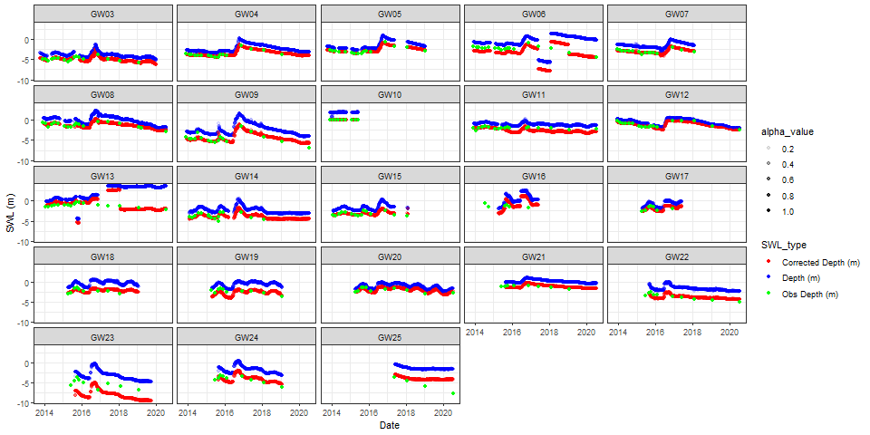
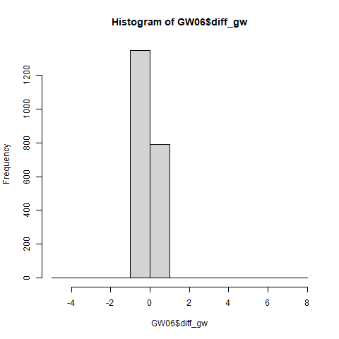
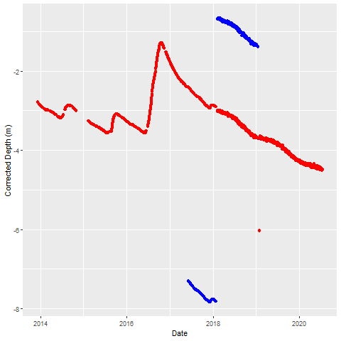
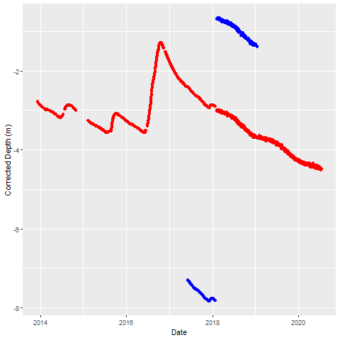
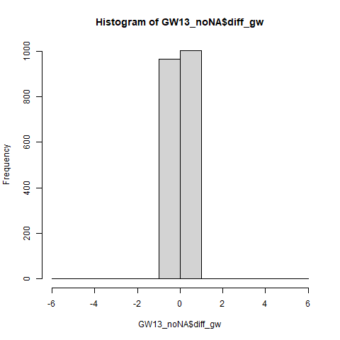
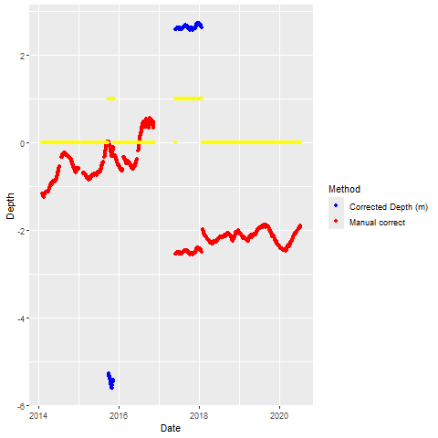

```{r setup, include=FALSE}
knitr::opts_chunk$set(echo = TRUE)
```

##  Introduction

This workflow and data provenance description is related to the groundwater level dataset in: "A detailed streamflow and groundwater salinity dataset for Muttama Creek Catchment, NSW, Australia", submitted to ESSD.

Automated scripts (*SummariseDailyData.R* and *Match_obs_logger_data.R*) have summarised the data to daily values, adjusted logger values for the depth of measurement and adjusted values based on the available manual observations. The raw data and the scripts are documented on the associated OSF project: [https://doi.org/10.17605/OSF.IO/BEUWK](https://doi.org/10.17605/OSF.IO/BEUWK). Here, only the daily data resulting from this earlier data management are used.

```{r piezodata, echo=F, fig.cap = "Groundwater level logger data corrected for cable length and automatically matched to observed data.", out.width="95%"}

#Muttama_maps.rmd
```

However, even after these adjustments, there are remaining anomalies in some of the logger timeseries that can only be manually adjusted (Figure \ref{fig:piezodata}). In particular, the loggers GW06 and GW13 show a mismatch between observed data and logger data, or show strange jumps in the logger data that clearly do not reflect groundwater behaviour.

The reasons for these differences can be unrecorded or lost recordings of adjustments to the logger cable. There is a note that suggest an adjustment to the GW06 and GW13 logger cables, but these don't fully explain the observed anomalies.

As the scripts and automatic adjustments have not been able to remove these anomalies, further adjustments can only be made manually. To properly provide a provenance of these adjustments in the final dataset, this document records all the manual adjustments and the reasoning behind those adjustments.

## Method

1.  load the R packages tidyverse and lubridate

```{r packages, warning = FALSE, message=FALSE}
require(tidyverse)
```

2.  read in the resulting data from the past analyses (i.e. the data shown in Figure \ref{fig:piezodata}).

```{r load_data}
GW_data <- read_csv("../Data/CorrectedPiezoObservations.csv")

```

## GW06

Filter out the data for the specific well

```{r GW06}
GW06 <- GW_data %>%
  filter(Piezo == "GW06")

```

Identify jumps in the data using diff()

```{r jumps-GW06}
GW06 <- GW06 %>%
  mutate(diff_gw = c(0,diff(GW06$`Corrected Depth (m)`)))


png("../figures/HistogramGW06_difference.png")
hist(GW06$diff_gw)
dev.off()
```

```{r hist-jumps-GW06, warning=FALSE, echo=F, fig.cap = "Histogram of the jumps in the GW06 differenced data",  out.width="80%"}



```

This indicates that any values \> 2 and \< -2 are the anomalies. We can find the points where this transitions and then find the values.

```{r find_dates}
Dates <- GW06 %>%
  filter(abs(diff_gw) > 2)
Dates
```

Comparing Figure \ref{fig:hist-jumps-GW06} to Figure \ref{fig:piezodata}, this means the section between `r Dates$Date[1]` and `r Dates$Date[2]` needs to be corrected by `r Dates$diff_gw[1]` being the difference in the anomaly (bias) at the beginning of the section. This value is close to the adjustment value in the field notes of 4.95m on *2017-06-02* which is also close to `r Dates$Date[1]`. The section past `r Dates$Date[2]` until `r Dates$Date[3]` needs to be corrected by `r Dates$diff_gw[3]` which is the estimate of the positive bias at the end. This value differs from the earlier correction and it is unclear where this difference comes from.

```{r GW06_manual}
# correction for the first section
correction1 <- Dates$diff_gw[1]
# correction for the second section
correction2 <- Dates$diff_gw[3]
GW06 <- GW06 %>%
  mutate(`Manual correct` = ifelse(GW06$Date >= Dates$Date[1] &
                                     GW06$Date < Dates$Date[2],
                                   `Corrected Depth (m)` -
                                     correction1,
                                   `Corrected Depth (m)`)) %>%
  mutate(Ind = ifelse(GW06$Date >= Dates$Date[1] &
                                     GW06$Date < Dates$Date[2],1,0))

GW06 <- GW06 %>%
  mutate(`Manual correct` = ifelse(GW06$Date >= Dates$Date[2] &
                                     GW06$Date <= Dates$Date[3]+1,
                                   `Manual correct` +
                                     correction2,
                                   `Manual correct`)) %>%
  mutate(Ind = ifelse(GW06$Date >= Dates$Date[2] &
                                     GW06$Date <= Dates$Date[3]+1,1,Ind))

png("../Figures/GW06_firstcorrection.png")
GW06 %>%
  ggplot(aes(Date,`Corrected Depth (m)`)) + 
  geom_point(colour = "blue") +
  geom_point(aes(Date,`Manual correct`),colour = "red")
dev.off()
```

```{r firstcorr-GW06, warning=FALSE, echo=F, fig.cap = "First correction of the GW06 groundwater level data",  out.width="80%"}



```

This appears to require one further correction,to removes the single anomaly in 2019.

```{r GW06_manual2}
# recalculate diff, but now based on manual correct
GW06 <- GW06 %>%
  mutate(diff_gw = c(0,diff(GW06$`Manual correct`)))

Dates <- GW06 %>%
  filter(abs(diff_gw) > 1.5)
Dates
```

```{r GW06_manual3}

correction3 <- Dates$diff_gw[1]

# GW06 <- GW06 %>%
#   mutate(`Manual correct` = ifelse(GW06$Date >= Dates$Date[1],
#                                    `Manual correct` -
#                                      correction3,
#                                    `Manual correct`))
#delete final point
GW06 <- GW06 %>% 
  mutate(`Manual correct` = ifelse(GW06$Date >= Dates$Date[1] &
                                     GW06$Date <= Dates$Date[2],
                                   NA,
                                   `Manual correct`)) %>%
  mutate(Ind = ifelse(GW06$Date >= Dates$Date[1] &
                                     GW06$Date <= Dates$Date[2],1,Ind))

png("../Figures/GW06_secondcorrection.png")
GW06 %>%
  ggplot(aes(Date,`Corrected Depth (m)`)) + 
  geom_point(colour = "blue") +
  geom_point(aes(Date,`Manual correct`),colour = "red")
dev.off()
```

```{r secondcorr-GW06, warning=FALSE, echo=F, fig.cap = "Second correction of the GW06 groundwater level data",  out.width="80%"}



```


Finally, we can clean up so we only retain the "Manual correct" column, but none of the intermediate columns.

## GW13

Essentially we will use the same process.

Filter out the data for the specific well

```{r GW13}
GW13 <- GW_data %>%
  filter(Piezo == "GW13")

```

Directly identifying jumps in the data using diff() does not work in this case due to missing data in the corrected depth data. so this needs to be filtered first, before calculating the `diff()` values

```{r GW13_jumps}

GW13_noNA <- GW13 %>%
  #filter(is.na(`Corrected Depth (m)`) == F) %>%
  mutate(diff_gw = c(0,diff(`Corrected Depth (m)`)))

png("../figures/HistogramGW13_difference.png")
hist(GW13_noNA$diff_gw)
dev.off()
```

```{r hist-jumps-GW13, warning=FALSE, echo=F, fig.cap = "Histogram of the jumps in the GW13 differenced data",  out.width="80%"}



```

Figure \ref{fig:hist-jumps-GW13} indicates that any values \> 1 and \< -1 are the anomalies. We can find the points where this transitions and then find the dates.

```{r find_dates_GW13}
Dates <- GW13_noNA %>%
  filter(abs(diff_gw) > 1) %>%
  arrange(Date)
Dates %>%
  dplyr::select(Date,diff_gw)
```

Comparing Figure \ref{fig:hist-jumps-GW13} to Figure \ref{fig:piezodata}, the first two dates relate to the small number of anomalies earlier in the time series. This means the section between `r Dates$Date[1]` and `r Dates$Date[2]` needs to be corrected by `r Dates$diff_gw[1]` being the difference in the anomaly (bias) at the beginning of the section.

The later section is trickier as the `diff()` results do not identify the correct anomaly in the data (which should be around 4 m), because of all the missing values in the data. The results from `diff()` only finds `r Dates$diff_gw[3]` as the largest difference, but this probably overdoes the correction.

```{r GW13_manual}
# correction for the first section
correction1 <- Dates$diff_gw[1]
# correction for the second section
correction2 <- Dates$diff_gw[3] 
GW13 <- GW13 %>%
  mutate(`Manual correct` = ifelse(GW13$Date >= Dates$Date[1] &
                                     GW13$Date < Dates$Date[2],
                                   `Corrected Depth (m)` -
                                     correction1,
                                   `Corrected Depth (m)`)) %>%
  mutate(`Manual correct` = ifelse(GW13$Date >=
                                     Dates$Date[4] &
                                     GW13$Date <
                                     Dates$Date[5],
                                   `Manual correct` -
                                     correction2,
                                   `Manual correct`)) %>%
  mutate(Ind = ifelse(GW13$Date >= Dates$Date[1] &
                                     GW13$Date < Dates$Date[2],1,0)) %>%
  mutate(Ind = ifelse(GW13$Date >=
                                     Dates$Date[4] &
                                     GW13$Date <
                                     Dates$Date[5],1,Ind))

png("../figures/Correction_GW13.png")
GW13 %>%
  pivot_longer(c(`Corrected Depth (m)`,`Manual correct`), values_to = "Depth",
              names_to = "Method") %>%
  ggplot(aes(Date, Depth, colour = Method)) + geom_point() +
  geom_point(aes(Date, Ind), colour = "yellow") +
  scale_colour_manual(values = c("Corrected Depth (m)" = "blue", "Manual correct" = "red"))
dev.off()
```

```{r corr-GW13, warning=FALSE, echo=F, fig.cap = "Correction of the GW13 groundwater level timeseries",  out.width="80%"}



```


## producing the final output

Combine the manually corrected values into the original data, but save this under a different file name. It is important to keep the different corrected versions separate.

Add a column `Source` to indicate what version of the data the final version is.

```{r final-output}
GW_data_output <- GW_data %>%
  mutate(`Final GW Depth (m)` = `Corrected Depth (m)`,
         Source = "Automatic correction") %>%
  filter(Piezo != 'GW06') %>%
  filter(Piezo != 'GW13')

GW06_f <- GW06 %>%
  mutate(`Final GW Depth (m)` = `Manual correct`,
         Source = ifelse(Ind == 1,
                         "Manual correction",'Automatic correction')) 
GW13_f <- GW13 %>%
  mutate(`Final GW Depth (m)` = `Manual correct`,
         Source = ifelse(Ind == 1,
                         "Manual correction",'Automatic correction')) 
         
GW_data_output <- bind_rows(GW_data_output, GW06_f, GW13_f)  
```

Now delete any of the intermediary columns

```{r clean-up}
png("../Figures/Final_Corrected_piezodepths.png", width = 1080, height = 760)

GW_data_output <- GW_data_output %>%
  dplyr::select(-c(`Depth (m)`,
            type.x, type.y, type, Int_depth))
GW_data_output %>%
  mutate(`Observed Depth (m)` = `Obs Depth (m)`) %>%
  pivot_longer(cols=c(`Observed Depth (m)`, `Final GW Depth (m)`), 
               names_to = "SWL_type", values_to = "SWL (m)") %>% 
  mutate(alpha_value = ifelse(SWL_type == "Observed Depth (m)",1,0.2),
         Source = ifelse(SWL_type == "Observed Depth (m)","Observed Depth (m)",Source)) %>%
  ggplot(aes(Date,`SWL (m)`, colour = Source, alpha = alpha_value)) + 
  geom_point() + 
  facet_wrap(~Piezo, ncol = 4) + theme_bw() + 
  scale_color_manual(values=c("Automatic correction" = "#E69F00",
                             "Manual correction" = "#56B4E9" ,
                             "Observed Depth (m)" = "#009E73")) +
  theme(axis.text = element_text(size  = rel(1.2)),
        axis.title = element_text(size = rel(1.2)),
        legend.text = element_text(size  = rel(1.2)),
        legend.title = element_text(size = rel(1.2)),) +
  scale_alpha(guide = 'none')
dev.off()
```

```{r gw-series, warning=FALSE, echo=F, fig.cap = "Overview of the corrected groundwater time series for all the wells", out.width="100%"}

knitr::include_graphics("../Figures/Final_Corrected_piezodepths.png")

```

Save the data to be used in the paper

```{r}
write_csv(GW_data_output, "../Data/Muttama_Piezometer_Output.csv")
```
